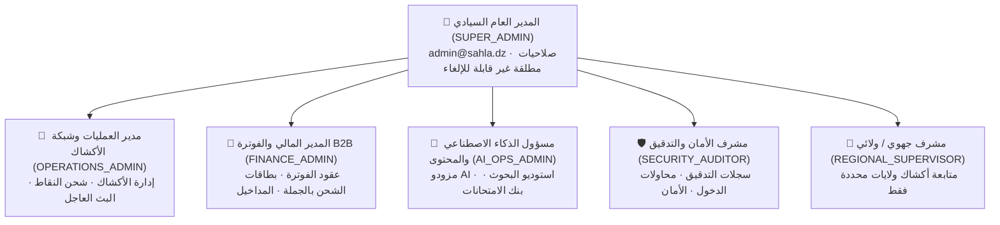

# 🇩🇿 وثيقة البنية المعمارية وخطة التنفيذ الشاملة
# نظام الحسابات والأدوار والصلاحيات للوحة تحكم مدير النظام
### منصة سهلة Sahla 2.0 · منظومة القيادة الوطنية المركزية (58 ولاية)
**نظام إدارة طاقم الإشراف، مصفوفة الصلاحيات (RBAC)، والتدقيق الأمني السيادي**

---

## 🎯 1. الرؤية والهدف الاستراتيجي (Strategic Objective)

في لوحة تحكم مدير النظام المركزي لـ **سهلة** (`/admin`)، يتطلب التوسع الوطني لـ 58 ولاية والتعامل مع آلاف الأكشاك والموزعين والفواتير والذكاء الاصطناعي توزيع المسؤوليات الإدارية عبر **نظام إدارة أدوار وصلاحيات هرمي متقدم (Role-Based Access Control - RBAC)**، بحيث:

1. **لا يقتصر الطاقم على حساب واحد أو رتبة واحدة:** التمييز بين المدير العام السيادي، ومدير شبكة الأكشاك، والمدير المالي للفوترة، ومسؤول عمليات الذكاء الاصطناعي، ومراقب الأمان والدعم.
2. **التحكم الحبيبي الدقيق (Granular Permissions):** إمكانية تعيين صلاحيات مخصصة لكل مشرف تمنعه من الوصول إلى أجزاء خارج اختصاصه (مثلاً: منع المدير المالي من تعديل مزودي الذكاء الاصطناعي، ومنع مدير الأكشاك من الوصول لحسابات البنوك وسجلات التدقيق).
3. **الحماية السيادية للحساب الرئيسي (Root Protection):** حظر مطلق لأي عملية حذف أو تجميد أو تخفيض صلاحية للحساب المركزي للمنصة (`admin@sahla.dz`).
4. **سجل التدقيق الأمني (Audit Logs Trail):** توثيق كل حركة إدارية (من أضاف مشرفاً، من جمّد محلاً، من شحن رصيداً، ومن أعاد تعيين كلمة مرور) مع الطابع الزمني وعنوان IP.

---

## 🏛️ 2. الهرمية الإدارية وتصنيف الأدوار (Admin Roles Hierarchy)



### توصيف الأدوار المركزية:

| الدور | الرمز التقني (`role`) | الشارة واللون | نطاق الصلاحيات الوظيفية |
| :--- | :--- | :---: | :--- |
| **المدير العام السيادي** | `SUPER_ADMIN` | 👑 ذهبي / تاج | صلاحيات مطلقة: إدارة جميع المشرفين، مفاتيح الـ API، النظام المالي، شحن النقاط، وكافة الـ 58 ولاية. |
| **مدير شبكة الأكشاك** | `OPERATIONS_ADMIN` | 🏢 زمرّدي / متجر | إدارة وتفعيل وتجميد الأكشاك، شحن النقاط الميدانية، حل مشاكل المحلات، وإرسال البث الوطني. |
| **المدير المالي B2B** | `FINANCE_ADMIN` | 💳 أزرق / فاتورة | إصدار فواتير B2B الرسمية، تتبع مدفوعات بريدي موب، توليد دفعات كروت الشحن للموزعين، ومراقبة الـ MRR/ARR. |
| **مسؤول الذكاء الاصطناعي** | `AI_OPS_ADMIN` | 🧠 بنفسجي / ذكاء | فحص وضبط مزودي الذكاء الاصطناعي (Ping)، استوديو البحوث، بنوك الامتحانات، ومراقبة استهلاك التوكنات. |
| **مشرف الأمان والتدقيق** | `SECURITY_AUDITOR` | 🛡️ برتقالي / درع | فحص سجلات الأنشطة (Audit Trail)، جلسات الدخول المشبوهة، إعادة تعيين كلمات المرور، ومتابعة الامتثال. |
| **مشرف إقليمي ولائي** | `REGIONAL_SUPERVISOR` | 📍 سماوي / خريطة | متابعة أكشاك محصورة ضمن مجموعة ولايات محددة (مثل: ولايات الوسط أو الغرب فقط). |

---

## 🔐 3. مصفوفة الصلاحيات الحبيبية (Granular Permissions Matrix)

تتكون كل صلاحية من رمز فريد (`slug`) يتم التحقق منه برمجياً قبل السماح بعرض التبويب أو تنفيذ إجراء بالـ API:

```typescript
export const ADMIN_PERMISSIONS = {
  // القيادة والتحليلات
  VIEW_ANALYTICS: "analytics:view",           // استعراض رادار الـ 58 ولاية والمؤشرات
  VIEW_DEEP_METRICS: "analytics:deep_metrics", // استعراض أرباح المنظومة والـ MRR/ARR

  // شبكة الأكشاك
  MANAGE_SHOPS: "shops:manage",               // تفعيل / تجميد / تعديل بيانات الأكشاك
  TOPUP_SHOP_POINTS: "shops:topup_points",     // شحن رصيد النقاط للمحلات
  DELETE_SHOPS: "shops:delete",               // حذف المحلات المخالفة

  // الفوترة والمالية
  MANAGE_INVOICES: "invoices:manage",         // إنشاء واعتماد وتعديل فواتير B2B
  MANAGE_WHOLESALE_CARDS: "wholesale:manage", // توليد وتصدير كروت الشحن بالجملة

  // الذكاء الاصطناعي
  MANAGE_AI_PROVIDERS: "ai:manage_providers", // ربط وحفظ واختبار مفاتيح نماذج الـ AI
  MANAGE_AI_CONTENT: "ai:manage_content",     // إدارة محتوى البحوث وبنوك الأسئلة

  // الأمان وإدارة الطاقم
  MANAGE_ADMINS: "admins:manage",             // إضافة وتعديل وحذف المشرفين
  RESET_ADMIN_PASS: "admins:reset_password",  // إعادة تعيين كلمات مرور الطاقم
  VIEW_AUDIT_LOGS: "audit:view_logs",         // قراءة سجلات العمليات والتدقيق الأمني
  SEND_BROADCAST: "broadcast:send",           // إطلاق البث والتعميم الوطني العاجل
} as const;
```

---

## 🗄️ 4. نموذج البيانات (Database Schema & Repository Architecture)

### 1. جدول / سجل المشرفين (`AdminUserRecord`):
```typescript
export interface AdminUserRecord {
  id: string;                      // معرف فريد: "admin_17914000123"
  name: string;                    // الاسم واللقب
  email: string;                   // البريد الإلكتروني الرسمي
  phone: string | null;            // رقم الهاتف الجزائري المعاير
  passwordHash: string;            // كلمة المرور المشفرة
  role: AdminRoleType;             // الدور المعياري
  customPermissions?: string[];    // صلاحيات إضافية مخصصة
  assignedWilayas?: number[];      // أرقام الولايات المخصصة (للمشرف الإقليمي)
  status: "ACTIVE" | "SUSPENDED";  // حالة الحساب
  isRoot: boolean;                 // true فقط لـ admin@sahla.dz (محمي تماماً)
  lastLoginAt: string | null;      // تاريخ آخر تسجيل دخول
  lastLoginIp: string | null;      // عنوان IP لآخر جلسة
  createdBy: string;               // معرف المشرف المنشئ
  createdAt: string;               // تاريخ الإنشاء
  updatedAt: string;               // تاريخ آخر تعديل
}
```

### 2. سجل التدقيق الأمني (`AdminAuditLogRecord`):
```typescript
export interface AdminAuditLogRecord {
  id: string;                      // "audit_17914000456"
  actorId: string;                 // معرف المشرف الفاعل
  actorName: string;               // اسم المشرف
  actorRole: AdminRoleType;        // رتبة المشرف
  action: AdminAuditActionType;    // نوع العملية (CREATE_ADMIN, SUSPEND, RESET_PWD...)
  targetId: string;                // معرف العنصر المتأثر
  targetType: "ADMIN" | "SHOP" | "INVOICE" | "AI_CONFIG";
  descriptionAr: string;           // وصف العملية بالعربية للمطالعة السريعة
  metadata?: Record<string, any>;  // تفاصيل إضافية (القيم قبل وبعد التعديل)
  ipAddress: string;               // عنوان IP
  timestamp: string;               // التوقيت الزمني الدقيق
}
```

---

## 🌐 5. هندسة الواجهات البرمجية (REST API Endpoints)

| المسار البرمجي (Route) | الطريقة (Method) | الصلاحية المطلوبة | الوظيفة والهدف |
| :--- | :---: | :---: | :--- |
| `/api/admin/admins` | `GET` | `admins:manage` | جلب قائمة كافة المشرفين مع إحصائيات الأدوار وحالات التفعيل. |
| `/api/admin/admins` | `POST` | `admins:manage` | إنشاء مشرف جديد مع تعيين دوره وصلاحياته ورقم هاتفه. |
| `/api/admin/admins/[id]` | `PATCH` | `admins:manage` | تعديل المشرف: تغيير الدور، تجميد أو إعادة تفعيل الحساب، تعديل الصلاحيات. |
| `/api/admin/admins/[id]` | `DELETE` | `admins:manage` | حذف حساب مشرف (محظور تماماً على الحساب الجذري `isRoot`). |
| `/api/admin/admins/[id]/reset-password` | `POST` | `admins:reset_password` | توليد كلمة مرور مؤقتة وتحديث تشفير كلمة المرور. |
| `/api/admin/admins/roles` | `GET` | عام للمشرفين | جلب قائمة الأدوار المعيارية والمصفوفة الافتراضية للصلاحيات. |
| `/api/admin/audit-logs` | `GET` | `audit:view_logs` | جلب سجل العمليات والتدقيق الأمني مع إمكانية الفرز والتصفية. |

---

## 🎨 6. تصميم واجهة المستخدم التفاعلية (UI/UX Component System)

سيتم تطوير تبويب **فريق الإشراف والأمان** (`AdminTeamTab.tsx`) ليصبح **مركزاً سيادياً متكاملاً (RBAC & Security Command Hub)** بدلاً من النموذج البسيط القديم:

```
┌────────────────────────────────────────────────────────────────────────────────────────┐
│ 🛡️ لوحة إدارة فريق الإشراف والأدوار (Admin Roles & Team Security)                      │
│ ────────────────────────────────────────────────────────────────────────────────────── │
│ [ 👥 5 مشرفين نشطين ] [ 👑 2 مدير عام ] [ 🏢 2 مدراء عمليات ] [ 🔒 0 حسابات موقوفة ]   │
│                                                                                        │
│ [ 🔍 بحث بالاسم / البريد... ]  [ تصفية حسب الدور ▼ ]  [ الحالة ▼ ]  [ + إضافة مشرف جديد ]│
│ ────────────────────────────────────────────────────────────────────────────────────── │
│  الاسم والبريد             الدور والرتبة            الصلاحيات      الحالة      الإجراءات   │
│ ────────────────────────────────────────────────────────────────────────────────────── │
│ 👑 مدير منصة سهلة المركزي    مدير النظام العام (Root)   12 صلاحية     🟢 نشط      [ سيادي 🔒 ] │
│ 🏢 كريم بلقاسم             مدير شبكة الأكشاك         5 صلاحيات     🟢 نشط      [ تعديل ⋮ ]  │
│ 🧾 ليلى سلطاني             المدير المالي B2B         4 صلاحيات     🟢 نشط      [ تعديل ⋮ ]  │
│ 🧠 أمين زياني              مسؤول الذكاء الاصطناعي     4 صلاحيات     🟢 نشط      [ تعديل ⋮ ]  │
│ 🛡️ هشام مزيان              مشرف الأمان والتدقيق       3 صلاحيات     🔴 موقوف    [ تعديل ⋮ ]  │
└────────────────────────────────────────────────────────────────────────────────────────┘
```

### المكونات البرمجية التي سيتم إنشاؤها:
1. **[`AdminTeamTab.tsx`](file:///home/ammar/Sahla%20/src/components/admin/tabs/AdminTeamTab.tsx):**
   - ترقية كاملة: كروت الإحصائيات (KPI Cards)، شريط البحث والفلترة، وجدول المشرفين التفاعلي بأسلوب Shadcn.
2. **`AdminMemberModal.tsx` (نافذة إضافة / تعديل مشرف):**
   - اختيار الدور المسبق (Preset Roles) مع بطاقات بصرية تبرز مسؤوليات كل دور.
   - خيار تخصيص الصلاحيات (Custom Permissions Toggles) للمشرفين الخاصين.
   - التحقق من البريد الإلكتروني ورقم الهاتف الجزائري.
3. **`AdminPasswordResetModal.tsx` (نافذة إعادة تعيين كلمة المرور):**
   - توليد كلمة مرور عشوائية قوية بنقرة واحدة، مع خيار نسخ مباشر وعرض أمني.
4. **`AdminAuditLogDrawer.tsx` (سجل التدقيق الأمني الفوري):**
   - استعراض مباشر لآخر العمليات الإدارية الحساسة التي تمت على المنصة.

---

## 🛡️ 7. قواعد الأمان السيادية (Security Invariants)

1. **حماية المدير الجذري (`Root Invariant`):**
   - يمنع منعاً باتاً من مستوى الـ API والواجهة تعديل دور أو حذف أو تجميد الحساب `admin@sahla.dz`.
2. **منع التعديل الذاتي لتخفيض الرتبة (`Self-Demotion Prevention`):**
   - لا يمكن للمشرف إيقاف حسابه الخاص أو إزالة صلاحية إدارة المشرفين عن نفسه مباشرة لحماية الاستمرارية.
3. **حماية مسارات الـ API:**
   - فحص التوكن والجلسة في كل طلب للتأكد من وجود صلاحية `admins:manage`.
4. **تشفير كلمات المرور وسريتها:**
   - لا تعود كلمات المرور إلى المتصفح نهائياً، وتستخدم خوارزمية تشفير آمنة، مع تعقيم مخرجات الـ API من أي حقول حساسة.

---

## 🚀 8. مراحل التنفيذ التفصيلية (Step-by-Step Implementation Roadmap)

### المرحلة 1: بنية البيانات والخدمات الخلفية (Backend Core)
- [ ] تحديث `src/server/config/constants.ts` ليشمل مصفوفة الأدوار `ADMIN_ROLES` وقائمة الصلاحيات `ADMIN_PERMISSIONS`.
- [ ] إنشاء مخزن المشرفين المتقدم `adminUserRepository.ts` وسجل التدقيق `auditLogRepository.ts`.
- [ ] إنشاء ملف البيانات الأولي `src/server/storage/data/admin_roles.json` مع بيانات تجريبية للأدوار المتنوعة.
- [ ] ترقية مسار `/api/admin/admins` لدعم الإحصائيات، الفلترة، وتعيين الصلاحيات المخصصة.
- [ ] إنشاء مسارات فرعية:
  - `PATCH /api/admin/admins/[id]` (تعديل وتجميد الحساب).
  - `DELETE /api/admin/admins/[id]` (حذف آمن).
  - `POST /api/admin/admins/[id]/reset-password` (إعادة تعيين كلمة المرور).
  - `GET /api/admin/audit-logs` (سجلات التدقيق).

### المرحلة 2: واجهات المستخدم والنوافذ المنبثقة (Frontend & Modals)
- [ ] إنشاء مكون نافذة إدارة المشرف `AdminMemberModal.tsx` (إضافة / تعديل الصلاحيات).
- [ ] إنشاء مكون نافذة إعادة تعيين كلمة المرور `AdminPasswordResetModal.tsx`.
- [ ] ترقية مكون `AdminTeamTab.tsx` بالكامل ليدعم:
  - كروت KPI الإحصائية السريعة.
  - جدول المشرفين المتقدم مع شارات الأدوار والصلاحيات الملونة.
  - قائمة الإجراءات السريعة (تعديل، تجميد/تفعيل، إعادة كلمة المرور، حذف).
  - ربط فوري مع مسارات الـ API مع إشعارات نجاح وتنبيهات خطأ أنيقة.

### المرحلة 3: تكامل الجلسة وتوزيع الصلاحيات (RBAC Session Integration)
- [ ] تحديث `UserNavDropdown.tsx` ليعرض المسمى الدقيق لكل مشرف بحسب دوره الفعلي (مثلاً: `المدير المالي B2B`، `مدير شبكة الأكشاك`، `مدير النظام العام`).
- [ ] ربط شريط التنقل الجانبي `AdminUnifiedSidebar.tsx` بصلاحيات الجلسة لإخفاء التبويبات غير المصرح بها تلقائياً.

### المرحلة 4: التدقيق، الاختبار والرفع (Testing & Deployment)
- [ ] اختبار سلامة الـ TypeScript بالكامل (`npx tsc --noEmit`).
- [ ] بناء الإنتاج للتأكد من عدم وجود أي خطأ (`npm run build`).
- [ ] إيداع التعديلات ورفعها إلى مستودع المشروع على **GitHub** (`main`).
