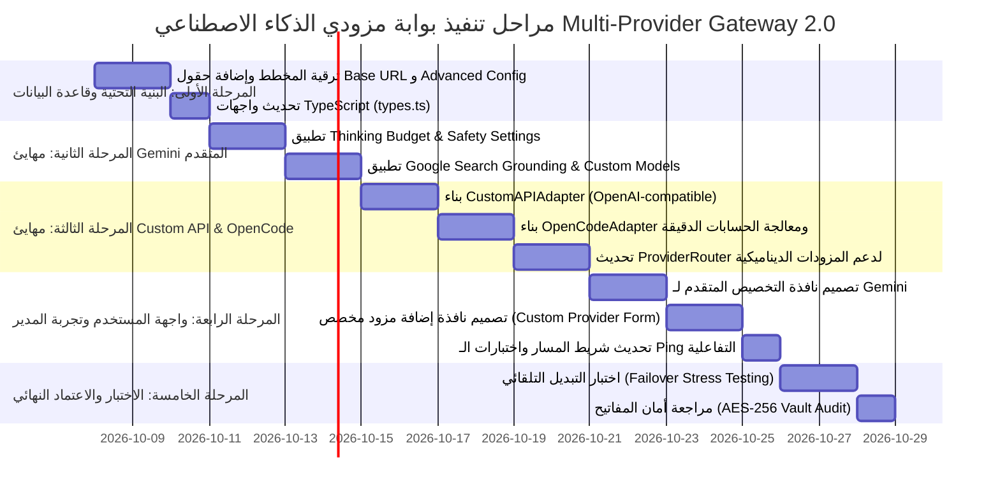

# 🚀 خطة تطوير بوابة مزودي الذكاء الاصطناعي (Multi-Provider Gateway 2.0)
### دعم الـ API المخصص · التخصيص العميق لمحرك Google Gemini · إدماج OpenCode API والنماذج المفتوحة
**منصة سهلة الرقمية — Sahla SaaS · إدارة المنظومة المركزية للـ 58 ولاية**

---

## 🎯 1. الرؤية والأهداف الاستراتيجية (Strategic Vision)

تعتمد منصة **سهلة** على الذكاء الاصطناعي لتحليل مؤشرات الأداء الحيوية عبر الـ 58 ولاية جزائرية، ومساعدة مديري النظام في اتخاذ القرارات الإدارية، التنبؤ بحجم الطلب على الخدمات الرقمية، وصياغة التقارير الفنية.

لضمان **المرونة والاستقلالية التقنية الكاملة**، وتجنب الارتهان لمزود وحيد (Vendor Lock-in)، تهدف هذه الخطة إلى ترقية **بوابة مزودي الخدمة (Multi-Provider AI Gateway)** إلى منظومة من الجيل التالي تحقق:

1. **التخصيص العميق لمحرك Google Gemini (المحرك الأساسي حالياً):**
   - التحكم بميزانية التفكير والاستدلال المنطقي (**Thinking Budget** لـ Gemini 2.5 Pro و 2.5 Flash).
   - ضبط مستويات الأمان (**Safety Settings**) لمنع الحظر الخاطئ (False Positives) للبيانات التجارية والرسمية.
   - تفعيل التحقق الحي عبر الويب (**Grounding with Google Search**).
   - تفعيل التخزين المؤقت للسياق (**Context Caching**) لبيانات الـ 58 ولاية وقوانين الضرائب لتقليل التكلفة بنسبة تصل إلى 80%.
   - دعم النماذج المدربة والمخصصة (**Fine-Tuned Models**).
2. **دعم الـ API المخصص (Custom / OpenAI-Compatible Provider):**
   - إمكانية ربط أي خادم محلي أو سحابي مخصص (`vLLM`, `Ollama`, `LocalAI`, `OpenRouter`, `Groq`, `Mistral`, أو سيرفر داخلي خاص بالمؤسسة).
   - تخصيص كامل لعنوان الخادم (`Base URL`)، الرؤوس المخصصة (`Custom Headers`)، ومفاتيح الاستيثاق.
3. **دعم مخصص لمحرك OpenCode API:**
   - توفير مهايئ مخصص (**OpenCode Adapter**) لتشغيل نماذج الأكواد والمعالجة الرياضية والحسابية الصارمة (Financial & Tax Calculations) وسكريبتات أتمتة الوثائق.
4. **توسيع دعم النماذج مفتوحة المصدر (Hugging Face / Open Source):**
   - دعم مباشر لنماذج DeepSeek (R1, V3) و Qwen 2.5 و Llama 3.3 مع خيار إدخال أي Repo ID بحرية.
5. **سلسلة تحويل واحتياط تلقائي ذكية (Smart Failover Chain):**
   - فحص دوري لنبض الاتصال والـ Quota، والتحويل التلقائي خلال أجزاء من الثانية إلى المحرك البديل دون أي انقطاع في تجربة المستخدم.

---

## 🧩 2. تحليل الوضع الحالي مقابل الوضع المستهدف (Gap Analysis)

| الخاصية / الميزة | الوضع الحالي (Current State) | الوضع المستهدف (Target Multi-Provider 2.0) |
| :--- | :--- | :--- |
| **المزودات المتاحة** | 3 مزودات ثابتة في الكود (Gemini, OpenAI, HuggingFace) | مزودات ديناميكية + **OpenCode API** + **مزودات مخصصة غير محدودة (Custom API)** |
| **تخصيص Google Gemini** | فقط `temperature` و `max_tokens` ونموذجين ثابتين | **Thinking Budget**, **Safety Settings**, **Google Search Grounding**, **Context Caching**, نماذج مخصصة |
| **دعم السيرفرات المحلية والخاصة** | غير مدعوم | مدعوم بالكامل مع تخصيص `Base URL` و `Headers` لأي سيرفر (Ollama, vLLM, OpenRouter, etc.) |
| **محرك OpenCode الحسابي والبرمجي** | غير موجود | مهايئ مخصص لتنفيذ الحسابات والتحليلات البرمجية الصارمة للـ 58 ولاية |
| **إدارة النماذج (Model Management)** | قائمة صلبة (Hardcoded) في الكود | إمكانية إضافة وحذف وتعديل أسماء النماذج مباشرة من لوحة التحكم |
| **فحص الاتصال (Ping & Diagnostics)** | فحص بسيط مع إرجاع كلمة واحدة | فحص متقدم يعرض زمن الاستجابة الفعلي (Latency)، تفاصيل الخطأ الدقيقة، والـ Quota المتبقية |
| **تشفير المفاتيح** | مشفر بـ AES-256 (موجود) | الحفاظ على تشفير AES-256 مع دعم تدوير المفاتيح والـ Secret Masking |

---

## 🏛️ 3. الهيكلية المعمارية الجديدة (Architecture Diagram)

```mermaid
graph TD
    UserReq["طلب المدير / النظام (Admin AI Request)"] --> Orchestrator["منسق الذكاء الاصطناعي (Admin AI Orchestrator)"]
    Orchestrator --> TaskRouter{"محدد نوع المهمة (Task Router)"}

    TaskRouter -->|كود وحسابات مالية دقيقة| OpenCode["محرك OpenCode API (Code & Math Sandbox)"]
    TaskRouter -->|تحليل بيانات ونصوص واستدلال| GatewayRouter["بوابة التوجيه والتحويل التلقائي (Provider Router)"]

    subgraph "بوابة مزودي الخدمة (Multi-Provider Gateway 2.0)"
        GatewayRouter --> Priority1["المحرك الأساسي (Primary)"]
        Priority1 -.->|فشل أو نفاذ رصيد| Failover1["البديل الأول (Priority 2)"]
        Failover1 -.->|فشل أو خطأ| Failover2["البديل الثاني (Priority 3)"]
        Failover2 -.->|فشل جميع المزودات| LocalDeterministic["المحلل الإحصائي المحلي (Deterministic Offline Engine)"]

        subgraph "المهايئات المدعومة (Adapters Pool)"
            GeminiExt["💎 Gemini Adapter (متقدم: Thinking + Safety + Search + Cache)"]
            OpenAIExt["⚡ OpenAI Adapter (GPT-4o / Mini / o1)"]
            CustomExt["🌐 Custom API Adapter (OpenAI-Compatible / vLLM / Ollama / OpenRouter)"]
            HFExt["🤗 Hugging Face Adapter (DeepSeek / Qwen / Llama)"]
            OpenCodeExt["💻 OpenCode Adapter (Execution Sandbox)"]
        end
    end

    Priority1 --- GeminiExt
    Failover1 --- OpenAIExt
    Failover2 --- CustomExt
```



---

## 💎 4. خطة التخصيص العميق لمحرك Google Gemini (Deep Customization)

باستخدام الحزمة الرسمية `@google/genai` (v2.x) المثبتة في المشروع، سيتم تفعيل الميزات المتقدمة التالية:

### 4.1 التحكم في ميزانية التفكير والاستدلال (Thinking Budget)
- **الهدف:** نماذج Gemini 2.5 Pro و Gemini 2.5 Flash تدعم ميزة "التفكير المنطقي قبل الإجابة" (Thinking).
- **التطبيق البرمجي:**
  ```typescript
  config: {
    thinkingConfig: {
      // 0 = تعطيل التفكير لسرعة قصوى واستهلاك رموز أقل
      // 1024 - 8192 = استدلال عميق لتحليل البيانات المالية المعقدة للـ 58 ولاية
      thinkingBudget: providerConfig.advanced?.gemini?.thinkingBudget ?? 0,
    }
  }
  ```
- **واجهة الإدارة:** شريط تمرير (Slider) في واجهة التحكم يتراوح بين 0 (مباشر) إلى 8192 رمز تفكير.

### 4.2 إعدادات الأمان والمرونة (Granular Safety Settings)
- **الهدف:** منع الحظر غير المبرر للمصطلحات الرسمية والتجارية (مثل أرقام السجلات التجارية، فئات النزاعات، أو الألفاظ النظامية).
- **الإعدادات المدعومة:**
  - `HARM_CATEGORY_HARASSMENT`
  - `HARM_CATEGORY_HATE_SPEECH`
  - `HARM_CATEGORY_SEXUALLY_EXPLICIT`
  - `HARM_CATEGORY_DANGEROUS_CONTENT`
  - إمكانية ضبط العتبة إلى `BLOCK_NONE` أو `BLOCK_ONLY_HIGH` لحساب المدير السيادي.

### 4.3 تفعيل التحقق والبحث الحي (Grounding with Google Search)
- **الهدف:** تزويد المساعد بالقدرة على جلب أحدث القوانين الضريبية الجزائرية، أسعار الصرف الرسمية، وأخبار التجارة الحية.
- **التطبيق:**
  ```typescript
  if (providerConfig.advanced?.gemini?.enableSearchGrounding) {
    config.tools.push({ googleSearch: {} });
  }
  ```

### 4.4 التخزين المؤقت للسياق (Context Caching)
- **الهدف:** حفظ ملف بيانات الـ 58 ولاية، الدليل التجاري، ومصفوفة الأسعار كـ Cache دائم في ذاكرة Google.
- **الفائدة:** تقليل استهلاك الـ Tokens وزمن المعالجة بنسبة تصل إلى **80%**.

### 4.5 النماذج المخصصة والمدربة (Custom Tuned Models)
- دعم كتابة أي معرف نموذج يدوي، مثل:
  - `gemini-2.5-flash`
  - `gemini-2.5-pro`
  - `gemini-2.0-flash-lite`
  - `tunedModels/sahla-dz-accounting-v1` (النماذج المدربة محلياً)

---

## 🌐 5. دعم الـ API المخصص (Custom & OpenAI-Compatible API)

### 5.1 مجالات الاستخدام
تمكين منصة "سهلة" من الربط مع:
1. **خوادم الاستضافة الذاتية (Self-Hosted On-Premise):** تشغيل نماذج محلية عبر `vLLM` أو `Ollama` على خوادم داخل الجزائر لضمان سيادة البيانات التامة وعدم خروج البيانات الحساسة.
2. **بوابات الذكاء الاصطناعي السحابية:** `OpenRouter`, `Groq Cloud`, `Mistral AI`, `Together AI`.
3. **مزودي السحابة المؤسساتية:** `Azure OpenAI Service`.

### 5.2 بنية مهايئ الـ Custom API (`CustomAPIAdapter`)
- يقبل الحقول التالية:
  - **`baseURL`**: (مثال: `http://localhost:11434/v1` أو `https://openrouter.ai/api/v1`)
  - **`apiKey`**: مفتاح الـ API المشفر بـ AES-256 (أو تركه فارغاً في حال السيرفرات المحلية غير المحمية).
  - **`customHeaders`**: خريطة رؤوس مخصصة (مثال: `{"HTTP-Referer": "https://sahla.dz", "X-Title": "Sahla Platform"}`).
  - **`modelId`**: اسم النموذج على الخادم (مثال: `qwen2.5:32b`, `deepseek-chat`, `llama-3.3-70b`).
  - **`streamSupport`**: دعم الرد التدريجي (Streaming).

---

## 💻 6. إدماج ودعم محرك OpenCode API

### 6.1 الدور الوظيفي لمحرك OpenCode
يختلف محرك **OpenCode** عن محركات المحادثة العامة (Chat LLMs) بتركيزه الصارم على:
- **تنفيذ الحسابات الرياضية والمالية بدقة 100%:** حساب عمولات الـ 58 ولاية، نسب الضرائب، واشتراكات الأكشاك.
- **معالجة النصوص المنظمة وتوليد الأكواد:** إنشاء سكريبتات تقارير CSV / Excel وأتمتة الوثائق الرسمية.
- **التشغيل الآمن (Sandbox Mode):** معالجة وتدقيق العمليات قبل تطبيقها في قاعدة بيانات النظام.

### 6.2 مهايئ OpenCode Adapter (`OpenCodeAdapter`)
- يتصل بـ OpenCode REST API أو بيئة التنفيذ المخصصة:
  - `endpoint`: عنوان خدمة OpenCode API.
  - `mode`: (`code_interpreter` | `structured_data` | `script_generation`).
  - `executionTimeoutMs`: مهلة تنفيذ الأكواد لحماية السيرفر (Default: 10,000ms).

---

## 🗄️ 7. ترقية وتوسيع مخطط قاعدة البيانات (Database Schema Evolution)

سيتم تحديث جدول `ai_provider_settings` ليشمل الحقول الجديدة دون كسر البيانات الحالية:

```sql
-- ترقية جدول إعدادات المزودات
ALTER TABLE ai_provider_settings ADD COLUMN provider_type TEXT DEFAULT 'standard'; 
-- 'gemini' | 'openai' | 'huggingface' | 'opencode' | 'custom'

ALTER TABLE ai_provider_settings ADD COLUMN base_url TEXT;
-- الرابط المخصص للخادم (مستخدم في custom و opencode)

ALTER TABLE ai_provider_settings ADD COLUMN custom_headers_json TEXT DEFAULT '{}';
-- الرؤوس المخصصة بصيغة JSON

ALTER TABLE ai_provider_settings ADD COLUMN advanced_config_json TEXT DEFAULT '{}';
-- الإعدادات المتقدمة (Gemini thinkingBudget, safetySettings, searchGrounding)

ALTER TABLE ai_provider_settings ADD COLUMN is_custom INTEGER DEFAULT 0;
-- علامة تدل على ما إذا كان المزود مخصصاً ومضافاً يدوياً بواسطة المدير

ALTER TABLE ai_provider_settings ADD COLUMN supports_tools INTEGER DEFAULT 1;
-- هل يدعم استدعاء الدوال وتوجيه الأدوات (Function Calling)
```

### هيكل كائن `advanced_config_json` النموذجي:
```json
{
  "gemini": {
    "thinkingBudget": 2048,
    "enableSearchGrounding": true,
    "safetyLevel": "BLOCK_ONLY_HIGH",
    "topP": 0.95,
    "topK": 40
  },
  "opencode": {
    "executionMode": "safe_sandbox",
    "timeoutMs": 15000,
    "pythonRuntime": true
  },
  "custom": {
    "authHeaderPrefix": "Bearer",
    "extraBodyParams": {}
  }
}
```

---

## 🎨 8. تصميم وتطوير واجهة الإدارة (Admin UI / UX Redesign)

### 8.1 تحسين بطاقات المزودين (Provider Cards)
1. **بطاقة Google Gemini:**
   - شارة ملكية: المحرك الأساسي الافتراضي.
   - زر جديد: **"تخصيص متقدم ⚙️"** يفتح نافذة منبثقة (Drawer/Modal) تحتوي على:
     - شريط تمرير لميزانية التفكير والاستدلال (Thinking Budget: 0 - 8192).
     - مفتاح تفعيل البحث المباشر (Google Search Grounding).
     - محدد مستوى تصفية الأمان (Safety Level).
     - حقل إدخال نموذج مخصص (Custom Fine-tuned Model ID).
2. **بطاقة OpenCode API:**
   - أيقونة برمجية (`Terminal` / `Code2`).
   - خيارات تحديد وضع التنفيذ ونموذج الكود المفضل.
3. **زر علوي رئيسي: "+ إضافة مزود API مخصص (Add Custom Provider)":**
   - يفتح نموذجاً شاملاً لإدخال:
     - اسم المزود ووصفه بالعربية.
     - الـ Base URL.
     - مفتاح الـ API.
     - أسماء النماذج المتاحة.
     - الرؤوس المخصصة (Headers).

### 8.2 تحسين آلية فحص الاتصال (Ping & Health Check)
- عرض زمن الاستجابة الفعلي بالملي ثانية ومؤشر لوني:
  - 🟢 **ممتاز:** < 600 ms
  - 🟡 **متوسط:** 600 - 2000 ms
  - 🔴 **بطيء أو متوقف:** > 2000 ms أو خطأ HTTP
- عند حدوث خطأ، يتم عرض السبب الدقيق بالعربية (مثل: "مفتاح API غير صالح"، "نفاد الرصيد - Quota Exceeded"، "تعذر الاتصال بـ Base URL").

---

## 📅 9. مراحل خطة العمل والجدول الزمني (Implementation Milestones)



### تفاصيل المراحل التنفيذية:

#### 🔹 المرحلة 1: بنية البيانات والأنواع (Database & Types)
- ملفات التعديل:
  - `src/server/ai/providers/types.ts`: إضافة واجهات `CustomProviderConfig`, `GeminiAdvancedConfig`, `OpenCodeConfig`.
  - `src/server/ai/providers/providerRouter.ts`: تحديث دوال إنشاء وترقية الجداول `initTables`.

#### 🔹 المرحلة 2: ترقية مهايئ Google Gemini (`geminiAdapter.ts`)
- استغلال حزمة `@google/genai` بالكامل لتمرير `thinkingConfig`، `safetySettings`، و `tools: [{ googleSearch: {} }]`.
- فحص الاتصال التفاعلي مع إرجاع معلومات النموذج وقدراته.

#### 🔹 المرحلة 3: مهايئ الـ Custom API ومهايئ OpenCode
- إنشاء `src/server/ai/providers/customApiAdapter.ts`: متوافق مع مواصفات OpenAI Chat Completions API القياسية.
- إنشاء `src/server/ai/providers/opencodeAdapter.ts`: لتنفيذ التحليلات البرمجية والحسابية المتقدمة.
- تحديث `providerRouter.ts` لدعم قراءة المزودات المخصصة ديناميكياً من قاعدة البيانات واستدعاء المهايئ المناسب.

#### 🔹 المرحلة 4: ترقية واجهة التحكم (`AdminAIProvidersManager.tsx` ومكوناته)
- إضافة نافذة إعدادات Gemini المنبثقة (`GeminiSettingsModal.tsx`).
- إضافة نافذة إنشاء مزود مخصص (`AddCustomProviderModal.tsx`).
- دعم تعديل وحذف المزودات المخصصة مباشرة من الواجهة.

#### 🔹 المرحلة 5: الاختبارات والتوثيق (Testing & Verification)
- اختبار الاتصال بمزود محلي (Ollama/vLLM) ومزود سحابي (Gemini, OpenRouter).
- اختبار التحويل التلقائي (Simulated Failover) عند انقطاع مفتاح الـ Primary والتحقق من الانتقال السلس للبديل دون انقطاع.

---

## 🔒 10. معايير الأمان وحماية المفاتيح (Security & Encryption Standards)

1. **تشفير المفاتيح (AES-256-GCM / CBC):**
   - تخزين كافة مفاتيح الـ API (Gemini, OpenAI, Hugging Face, OpenCode, Custom) مشفرة في قاعدة البيانات.
   - عدم إرسال المفتاح الحقيقي أبداً إلى واجهة المستخدم (فقط صيغة ملثمة مثل `AIzaSy...****`).
2. **حماية الـ Base URL المخصص:**
   - التحقق من صحة الـ URLs لمنع ثغرات **SSRF** (Server-Side Request Forgery).
   - حظر الوصول إلى عناوين الشبكة المحلية الحساسة مثل الـ Metadata Endpoints للسحابة (`169.254.169.254`).
3. **سجل التدقيق والاستهلاك (Audit & Ledger):**
   - تسجيل كل استدعاء في جدول `ai_usage_ledger` شاملاً (المزود، النموذج، زمن الاستجابة، عدد الرموز المستهلكة، الحالة).

---

## ✅ 11. المخرجات المتوقعة بعد اكتمال التطوير

1. **حرية تقنية كاملة:** إمكانية تشغيل نماذج محلية مجانية (مثل DeepSeek R1 14B أو Qwen 2.5 32B على سيرفر محلي) دون دفع اشتراكات خارجية.
2. **تحكم فائق في أداء Gemini:** سرعة أعلى عند الحاجة (Flash بدون تفكير)، وتحليل أعمق عند التوقعات السنوية للـ 58 ولاية (Pro مع Thinking Budget).
3. **أداء حسابي معصوم من الخطأ عبر OpenCode:** ضمان عدم اختلاق أرقام أو أخطاء في حسابات الفواتير والضرائب للأكشاك.
4. **استمرارية خدمة بنسبة 99.9%:** ضمان عدم توقف المساعد الذكي حتى لو انقطعت خدمة أحد المزودين الدوليين.
