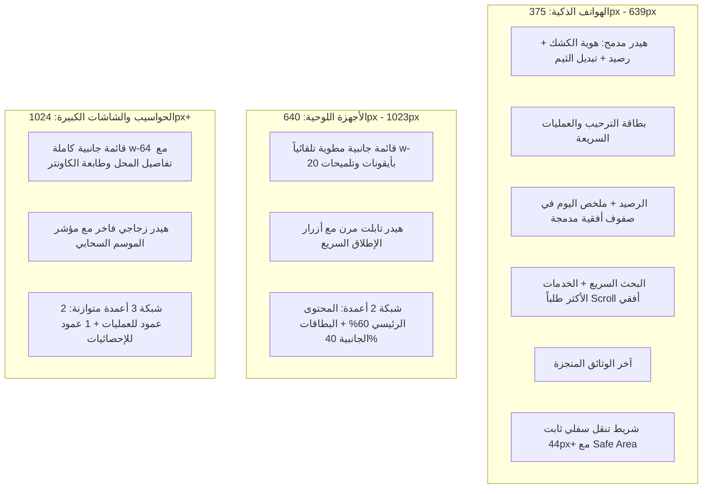

# 📱 خطة التوافق التجاوبي الشامل وتناسق عناصر لوحة التحكم (/dashboard)
### هندسة تجربة المستخدم المتجاوبة وتنظيم العناصر وفق معايير UI/UX Pro Max و Shadcn UI · سهلة Sahla 2.0

---

## 🎯 1. الرؤية وأهداف الخطة (Vision & Objectives)

تهدف هذه الخطة إلى تحويل لوحة تحكم الكاونتر (`http://localhost:3000/dashboard`) إلى واجهة فائقة التناسق والجمال (Pixel-Perfect Responsive SaaS Dashboard) تعمل بسلاسة مطلقة عبر جميع أحجام الشاشات (الهواتف الذكية، الأجهزة اللوحية/التابلت، الحواسيب المحمولة، والشاشات العريضة)، مع الالتزام التام بالمعايير العالمية في دليل **UI/UX Pro Max**:

1. **توافق كامل مع 4 نطاقات شاشات (4 Responsive Breakpoints):**
   - **الهاتف المحمول (Mobile - 375px إلى 639px):** وصول فوري باليد الواحدة، أهداف لمس 44px+، عدم تراكم البطاقات أو الحاجة للتمرير اللانهائي.
   - **التابلت (Tablet / iPad - 640px إلى 1023px):** تصغير ذكي للقائمة الجانبية (`md:w-20`) لتوفير مساحة العمل، وشبكة مزدوجة (2-column layout) تمنع هبوط بطاقات الرصيد والإحصائيات إلى القاع.
   - **الحاسوب المكتبي (Desktop - 1024px إلى 1439px):** شبكة ثلاثية متوازنة، شريط جانبي موسع مع توازن بصري دقيق.
   - **الشاشات العريضة (Ultra-wide - 1440px+):** أقصى عرض حاوية `max-w-7xl` لمنع تمدد العناصر وفقدان التركيز البصري.
2. **تناسق كل عنصر (Component Uniformity & Design Tokens):**
   - استبدال الألوان الصلبة القديمة (`slate-900`, `white`, `slate-200`) بمتغيرات **Shadcn UI** الدلالية (`bg-card`, `bg-background`, `border-border`, `text-foreground`, `text-muted-foreground`).
   - توحيد تدوير الحواف (Border Radius Hierarchy: `rounded-2xl` للبطاقات العادية، `rounded-3xl` للبطاقات الترحيبية والبانرات).
   - توحيد نظام التباعد (Spacing Rhythm: شبكة 8px بمقاييس `gap-3`, `gap-4`, `gap-6`).
   - استبدال الرموز العشوائية بأيقونات Lucide SVG متناسقة الأحجام (16px / 18px / 20px).
3. **تنظيم العناصر وإعادة الهيكلة الهرمية (Information Architecture & Flow):**
   - تنظيم صفحة `overview` لتكون مركز عمليات سريع (Quick Counter) دون إثقالها بدليل الخدمات الكامل الذي يملك تبويباً مخصصاً (`services`).
   - إبراز الرصيد والملخص اليومي في موضع استراتيجي يراه صاحب الكشك فوراً دون تمرير.

---

## 🔍 2. تحليل الوضع الحالي ونقاط القصور (Current Pain Points Audit)

| العنصر / الشاشة | السلوك الحالي | الخلل وفق UI/UX Pro Max | الحل المقترح في الخطة |
| :--- | :--- | :--- | :--- |
| **الهاتف المحمول (< 640px)** | بطاقات الرصيد والملخص اليومي تظهر في نهاية الصفحة بعد عشرات بطاقات الخدمات. | إجهاد بصري وتمرير طويل للوصول للرصيد؛ مخالف لمبدأ *Content-First*. | وضع كبسولة الرصيد والملخص السريع في أعلى الصفحة مع تبويب نظيف. |
| **شريط الهاتف السفلي (Bottom Nav)** | 5 عناصر متقاربة دون مسافة أمان سفلية (`safe-area-inset`). | صعوبة النقر باللمس على أجهزة iPhone و Android الحديثة. | تطبيق مساحات لمس `min-h-[44px]`، وإضافة فئة `safe-bottom`، وتفعيل ردود الفعل الحركية. |
| **التابلت (768px - 1023px)** | القائمة الجانبية تستهلك 256px، والمحتوى ينهار إلى عمود واحد فقط وتختفي البطاقات الجانبية في الأسفل. | إهدار لمساحة التابلت وشعور بضيق الواجهة. | طي القائمة الجانبية تلقائياً في التابلت (`md:w-20`)، وتقسيم المحتوى إلى شبكة 2 أعمدة. |
| **شريط البحث السريع (`QuickSearch`)** | خلفية داكنة صلبة `bg-slate-900 text-white` حتى في الوضع النهاري المشرق. | انكسار مظهر الوضع المشرق (Light Mode) وضعف تباين الألوان. | ربطه بـ `bg-card border-border text-foreground` ليتكيف فورياً مع كلا الوضعين. |
| **دليل الخدمات في الرئيسية (`ServicesFullGrid`)** | تكرار عرض نفس الشبكة الضخمة (30KB) في الرئيسية وفي تبويب "دليل الخدمات". | تشويش بصري وتكرار وظيفي غير مبرر في الشاشة الرئيسية. | إبقاء قسم "الخدمات الأكثر طلباً" والبحث السريع في الرئيسية، ونقل الشبكة الكاملة إلى تبويب الخدمات المخصص. |
| **تناسق البطاقات الجانبية** | تباين في الهوامش والبادينغ والظلال بين `BalanceCard` و `DailySummary` و `StarterChecklist`. | غياب التناغم الإيقاعي البصري (Rhythmic Inconsistency). | توحيد هيكل البطاقات باستخدام `Card` و `CardHeader` و `CardContent` ببادينغ قياسي موحد. |

---

## 📐 3. الهيكل المعماري المتجاوب عبر أحجام الشاشات (Responsive Grid Hierarchy)



---

## 🎨 4. توحيد نظام التصميم والعناصر (Design Tokens & Uniformity Standard)

### أ. لوحة الألوان والأسطح الدلالية (Semantic Color Mapping):
- **الخلفية العامة:** `bg-background` (تتحول تلقائياً من `#020617` في المظلم إلى `#F8FAFC` في المشرق).
- **أسطح البطاقات:** `bg-card` مع `border-border` و `text-card-foreground` وظل رقيق `shadow-xs`.
- **الأسطح الثانوية والتفاعلية:** `bg-muted/40 hover:bg-muted/70` مع انتقالات سلسة (150ms).
- **التركيز والأزرار الرئيسية:** `bg-primary text-primary-foreground` وتأثير نقر خفيف `active:scale-[0.98]`.
- **الشارات التنبيهية (Badges):**
  - شارة الرصيد والأرباح: `bg-emerald-500/10 text-emerald-600 dark:text-emerald-400 border-emerald-500/25`
  - شارة التحذير: `bg-amber-500/10 text-amber-600 dark:text-amber-400 border-amber-500/25`
  - شارة الخطر (الرصيد الصفري): `bg-rose-500/10 text-rose-600 dark:text-rose-400 border-rose-500/25`

### ب. المقاييس الهندسية الموحدة (Geometric Standards):
- **أقطار الحواف (Border Radii):**
  - البطاقات الرئيسية: `rounded-2xl` (16px).
  - البانر الترحيبي والاستوديو: `rounded-3xl` (24px).
  - الأزرار والحقول والشارات: `rounded-xl` (12px).
- **إيقاع التباعد (Spacing System):**
  - بين الأقسام الرئيسية: `space-y-6` (24px).
  - بين البطاقات في الشبكة: `gap-4 sm:gap-6`.
  - بادينغ داخلي للبطاقات: `p-4 sm:p-5 lg:p-6`.
- **الطباعة والخطوط (Typography):**
  - العناوين الرئيسية: `font-black text-lg sm:text-xl font-cairo text-foreground`.
  - النصوص الفرعية: `text-xs sm:text-sm text-muted-foreground leading-relaxed`.
  - الأرقام والأسعار والنقاط: `font-mono font-black tracking-tight`.

---

## 🧩 5. إعادة تنظيم وترتيب شاشة الكاونتر الرئيسية (`DashboardOverviewTab`)

بدلاً من تكديس كل الأدوات في عمود لا ينتهي، سيتم ترتيب العناصر وفق الأولوية الميدانية لصاحب الكشك:

```
┌────────────────────────────────────────────────────────────────────────┐
│ 1. البانر الترحيبي ونبض الكاونتر (شامل لمؤشر الأرباح وعدد وثائق اليوم)  │
├───────────────────────────────────┬────────────────────────────────────┤
│ 2. المحتوى العملياتي (العمود الأكبر)│ 3. ملخص الإدارة (العمود المساعد)   │
│  - حقل البحث السريع التكيفي (/)    │  - بطاقة الرصيد والشحن السريع       │
│  - الخدمات الأكثر طلباً في محلك    │  - ملخص النشاط اليومي المتناسق     │
│  - بطاقات الإطلاق السريع الأفقية    │  - قائمة مهام الانطلاقة           │
│  - آخر الوثائق المنجزة مع الطباعة  │  - بطاقة الدعم الفني وحالة الطابعة  │
│  - زر الانتقال لدليل الخدمات الكامل│                                    │
└───────────────────────────────────┴────────────────────────────────────┘
```

> **ملاحظة محورية:** في شاشات الهاتف والتابلت، يتم رفع بطاقة الرصيد والملخص اليومي ليظهرا مباشرة تحت البانر الترحيبي لتجنب التمرير المرهق.

---

## 🛠️ 6. مراحل التنفيذ التفصيلية (Execution Phases)

### 🔹 المرحلة 1: ترقية تخطيط الداشبورد العام والهيدر والشريط الجانبي
- **الملفات:**
  - `src/components/dashboard/layout/DashboardClientLayout.tsx`
  - `src/components/dashboard/layout/DesktopSidebar.tsx`
  - `src/components/dashboard/BottomNavBar.tsx`
- **المهام:**
  1. استبدال ألوان `slate-*` الثابتة بمتغيرات `bg-background` و `border-border` و `text-foreground`.
  2. ضبط السلوك التجاوبي للشريط الجانبي: طي تلقائي في مقاس التابلت (`md:w-20`) وتوسيع في الشاشات الأكبر (`lg:w-64`).
  3. إضافة مساحات لمس مناسبة `safe-bottom` وأهداف لمس 44px لشريط التنقل السفلي في الهاتف.
  4. تحسين الهيدر لعدم انكسار النصوص في الهواتف الصغيرة (375px).

### 🔹 المرحلة 2: إصلاح وتنسيق مكونات البحث والخدمات السريعة
- **الملفات:**
  - `src/components/dashboard/QuickSearch.tsx`
  - `src/components/dashboard/FrequentServices.tsx`
- **المهام:**
  1. تحويل `QuickSearch` ليعتمد على `bg-card` و `border-border` و `text-foreground` ليعمل بنقاء تام في الوضعين المشرق والمظلم.
  2. تحسين تدرجات وأبعاد كروت `FrequentServices` لتدعم التمرير الأفقي السلس مع مؤشرات لمس واضحة.

### 🔹 المرحلة 3: توحيد وهيكلة بطاقات الرصيد والإحصائيات
- **الملفات:**
  - `src/components/dashboard/BalanceCard.tsx`
  - `src/components/dashboard/DailySummary.tsx`
  - `src/components/dashboard/StarterChecklist.tsx`
  - `src/components/dashboard/SupportCard.tsx`
- **المهام:**
  1. توحيد البادينغ، والظلال، وتأثيرات الـ Glow الخلفية في `BalanceCard`.
  2. جعل شبكة `DailySummary` تستجيب بسلاسة من عمود واحد إلى 3 أعمدة حسب عرض الشاشة.
  3. ضبط قائمة مهام الانطلاقة لتبدو مدمجة ومتناغمة مع باقي البطاقات.

### 🔹 المرحلة 4: إعادة تنظيم صفحة `DashboardOverviewTab` وشبكة الخدمات
- **الملفات:**
  - `src/components/dashboard/home/DashboardOverviewTab.tsx`
  - `src/components/dashboard/RecentDocuments.tsx`
- **المهام:**
  1. تطبيق شبكة مرنة: عمود واحد في الهاتف، عمودان في التابلت، 3 أعمدة في الحاسوب.
  2. ترتيب تدفق العناصر بحيث تظل الإحصائيات الحيوية والرصيد في متناول يد صاحب المحل دائماً.
  3. تحسين بطاقات "آخر الوثائق المنجزة" لتتكيف أفقياً ورأسياً بسلاسة مع أزرار الطباعة والتعديل.

### 🔹 المرحلة 5: الفحص الشامل واختبار الشاشات الأربعة
- فحص الصفحة على أبعاد:
  - **375px** (iPhone SE / هواتف صغيرة)
  - **768px** (iPad / تابلت كاونتر)
  - **1024px** (شاشات حواسيب محمولة)
  - **1440px+** (شاشات كاونتر عريضة)
- فحص التبديل بين الوضعين المظلم والمشرق للتأكد من خلو الشاشة من أي عناصر شاذة.

---

## 📊 7. قائمة التحقق للجاهزية (UI/UX Pro Max Checklist)

- [ ] استخدام أيقونات SVG القياسية (Lucide) بنسبة 100% دون إيموجيات عشوائية كأزرار تحكم.
- [ ] وجود مؤشر `cursor-pointer` وتأثيرات `active:scale-[0.98]` على جميع الأزرار والبطاقات التفاعلية.
- [ ] تباين ألوان النصوص لا يقل عن 4.5:1 وفق معايير إمكانية الوصول WCAG AA.
- [ ] دعم كامل ومجرب لـ 4 مقاسات شاشات (375px, 768px, 1024px, 1440px).
- [ ] احترام كامل لاتجاه النص العربي والواجهة من اليمين إلى اليسار (RTL First).
- [ ] توافق كامل وسلس مع تبديل الثيم المظلم والمشرق.
