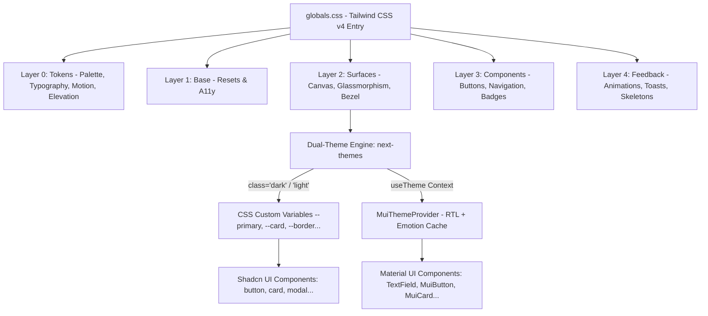

# 🎨 التحليل المعماري الشامل لنظام التصميم ورصد الأخطاء
### منصة سهلة 2.0 · Sahla Design System Deep-Dive & Code Audit

---

## 📌 1. نظرة عامة على معمارية نظام التصميم (Architecture Overview)

يعتمد نظام التصميم في منصة **سهلة (Sahla 2.0)** على معمارية هجينة معاصرة (Hybrid Architecture):
1. **محرك Tailwind CSS v4 المعماري المتقدم:** مع تنظيم خماسي الطبقات (5-Layer Modular Micro-Styles Architecture).
2. **مكونات Shadcn UI الموجهة بالرموز الدلالية (Semantic Tokens + CVA):** لضمان المرونة القصوى والأداء العالي.
3. **تكامل متقدم مع Material-UI v6:** مدعوم بمحرك الـ RTL التلقائي (`stylis-plugin-rtl`) ومزامنة فورية مع الوضعين الليلي والنهاري.
4. **فلسفة RTL-First والهوية الجزائرية المعاصرة:** تصميم مخصص لتجربة المستخدم الجزائرية بالخطوط العربية الحديثة (Cairo) مع دعم الأرقام الإنجليزية/اللاتينية الموحدة والعملة الوطنية (دج).



---

## 🌈 2. تحليل منظومة الألوان (Color System Deep-Dive)

### 2.1 لوحات الألوان الأساسية والهوية الجزائرية (Core Brand Palettes)
تم بناء اللوحة اللونية في `src/styles/tokens/palette.css` و `src/lib/theme/colors.ts` استلهاماً من الهوية الوطنية الجزائرية:

| اسم اللوحة | التدرجات (Scale) | درجات الألوان النموذجية | الاستخدام الدلالي في المنظومة |
| :--- | :--- | :--- | :--- |
| **الأخضر الزمردي الجزائري**<br>*(Emerald Palette)* | `50` إلى `900` | • **500:** `#10b981` (الرئيسي بالوضع الليلي)<br>• **600:** `#059669` (الرئيسي بالوضع النهاري)<br>• **700:** `#047857` (Hover نقي)<br>• **100:** `#d1fae5` (شارات وخلفيات خفيفة) | هوية المنصة الرسمية، الأزرار الرئيسية (CTA)، مؤشرات النجاح، وتأكيد المعاملات وسحب الوثائق. |
| **الذهبي الصحراوي**<br>*(Sahara Gold / Amber)* | `400` إلى `600` | • **400:** `#fbbf24`<br>• **500:** `#f59e0b`<br>• **600:** `#d97706` | شارات رتبة مدير النظام (Super Admin)، رصيد نقاط التعبئة، والاشتراكات السنوية المدفوعة. |
| **أحمر الياقوت الجزائري**<br>*(Algerian Ruby / Red)* | `400` إلى `600` | • **400:** `#f87171`<br>• **500:** `#ef4444`<br>• **600:** `#dc2626` | التنبيهات والبث الوطني العاجل، تجميد المحلات، والإجراءات الحساسة (Destructive Actions). |
| **أزرق الليل والرماديات الفاخرة**<br>*(Midnight Navy / Slate)* | `50` إلى `950` | • **950:** `#020617` (عمق OLED)<br>• **900:** `#0f172a` (سطح الكروت بالليلي)<br>• **800:** `#1e293b` (الحدود بالليلي)<br>• **50:** `#f8fafc` (الخلفية بالنهاري) | خلفيات الصفحات، الأسطح المرتفعة، القوائم الجانبية، والحدود الفاصلة. |

---

### 2.2 المتغيرات الدلالية وثنائية المظهر (Semantic Tokens & Dual-Theme)
تدار جميع المتغيرات في `src/styles/surfaces/canvas.css` ومربوطة بـ `next-themes` عبر كلاس `.dark` على وسم `<html>`:

```css
/* ── الوضع المشرق (Light Mode) ── */
html:not(.dark) {
  --background: #f8fafc;        /* رمادي فائق النقاء */
  --foreground: #0f172a;        /* كحلي داكن مقروء بنسبة تباين 14:1 */
  --card: #ffffff;              /* أبيض ناصع للكروت */
  --card-foreground: #0f172a;
  --primary: #059669;           /* زمردي داكن مريح في الإضاءة النهارية */
  --primary-foreground: #ffffff;
  --muted: #f1f5f9;
  --muted-foreground: #64748b;
  --border: #e2e8f0;            /* حدود ناعمة */
}

/* ── الوضع المظلم (Dark Mode) ── */
html.dark {
  --background: #080c14;        /* أسود كحلي عميق مضاد لإجهاد العين */
  --foreground: #f8fafc;        /* أبيض ناصع بنسبة تباين 15.5:1 */
  --card: #0f172a;              /* بطاقات زجاجية داكنة */
  --card-foreground: #f8fafc;
  --primary: #10b981;           /* زمردي ناصع ساطع في الظلام */
  --primary-foreground: #022c22;
  --muted: #1e293b;
  --muted-foreground: #94a3b8;
  --border: #1e293b;            /* حدود دقيقة غير مزعجة */
}
```

---

## 🧩 3. تحليل هيكل المكونات والأسطح (Components & Surfaces)

### 3.1 طبقة الأسطح والزجاج (Surfaces & Glassmorphism)
- **`glass.css`:**
  - `.glass-sidebar`: شريط جانبي بلوري مائل مع تأثير `backdrop-filter: blur(20px)`.
  - `.glass-card-subtle`: كروت شفافة عصرية مع تأثير رفع طفيف وتوهج زمردي خفيف عند التمرير (`Hover Elevation`).
- **`bezel.css`:**
  - `.bezel-surface` و `.bezel-inner`: حدود ثنائية دقيقة تعطي إيحاء المعدن المصقول لأجهزة الكاونتر والبطاقات الرسمية.

### 3.2 المكونات الأساسية (Reusable UI Components)
1. **`ThemeToggle.tsx`:** زر المظهر الموحد بثلاثة أشكال (`icon`, `button`, `chip`) مع منع وميض التحميل (Hydration Flash-Free).
2. **`button.tsx`:** مدعوم بمكتبة CVA مع أنماط `primary`, `secondary`, `gold`, `destructive`, `outline`, `ghost`, `link`.
3. **`card.tsx`:** بطاقات سحابية متوافقة تلقائياً مع الثيم.
4. **`material-text-field.tsx`:** حقول إدخال Material UI مهيأة للكتابة باللغة العربية (RTL).

---

## 🛠️ 4. دليل التعديل والتخصيص خطوة بخطوة (Customization Guide)

1. **لتعديل لون الهوية الأساسي:**
   - حدّث `src/styles/tokens/palette.css` (تدرجات `--color-primary-*`).
   - حدّث `src/styles/surfaces/canvas.css` (قيم `--primary` للوضعين).
   - حدّث `src/lib/theme/colors.ts` لمزامنة Material UI.
2. **لإضافة متغير دلالي جديد (مثل `--warning`):**
   - عرّفه في `globals.css` تحت `@theme inline`.
   - عيّن قيمه بالنهاري والليلي في `canvas.css`.
3. **لتعديل الخطوط العربية واللاتينية:**
   - عيّن المتغيرات في `src/styles/tokens/typography.css` (`--font-family-ar`, `--font-family-en`).
   - تأكد من استيراد ملفات الخط في `src/app/layout.tsx`.

---

## 🚨 5. رصد وتحديد الأخطاء ونقاط الضعف المعمارية (Errors & Design Debt Audit)

أظهر التحليل المعماري الدقيق وجود **7 أخطاء ونقاط ضعف وتضاربات برمجية** في نظام التصميم الحالي يجب معالجتها:

---

### ❌ الخطأ 1: كسر الثيم بالألوان الصلبة المباشرة (Hardcoded Hex Colors in MUI Sx Props)
* **المشكلة:**
  في ملفات عديدة مثل:
  - `HeroSection.tsx` (سطر 53-54): `bgcolor: "#10b981", "&:hover": { bgcolor: "#059669" }`
  - `CtaBanner.tsx` (سطر 30-31): `bgcolor: "#10b981"`
  - `AdminHeader.tsx` (سطر 65-66): `bgcolor: "#10b981"`
  - `PricingCard.tsx` و `RoiCalculator.tsx`
* **الأثر السلبي:**
  هذه الألوان الصلبة (`#10b981`) تتجاوز نظام الثيم! فعندما يختار المستخدم **الوضع النهاري (Light Mode)**، يُفترض أن يكون اللون الأخضر النهاري هو `#059669` بدرجة تباين أعلى، لكن الزر يظل مجمداً على اللون الفاتح المخصص للوضع الليلي، مما يقلل وضوح النص الأبيض فوقه ويكسر تناسق الثيم النهاري.
* **الحل المعماري:**
  استبدال الـ Hex المباشر بقيم الثيم الدلالية في MUI:
  ```tsx
  // ❌ خطأ
  sx={{ bgcolor: "#10b981", "&:hover": { bgcolor: "#059669" } }}

  // ✅ صحيح
  sx={{ bgcolor: "primary.main", color: "primary.contrastText" }}
  ```

---

### ❌ الخطأ 2: تشتت المرجع وازدواجية وثائق التصميم (Stale Design System Master Doc)
* **المشكلة:**
  يوجد في المشروع ملف قديم باسم `design-system/sahla/MASTER.md`.
  هذا الملف يوثق لوحة ألوان مختلفة تماماً (اللون الأساسي الذهبي `#F59E0B` والبنفسجي `#8B5CF6`)، وخطوطاً مغايرة (`EB Garamond` و `Lato`).
* **الأثر السلبي:**
  أي مطور جديد يدخل المشروع ويقرأ هذا الملف سيعتقد أن هذه هي القواعد المعتمدة، بينما الكود الحقيقي المطبق بالكامل في `src/styles/` و `src/app/globals.css` يعتمد على الأخضر الزمردي `#10b981` وخط Cairo ونظام Tailwind CSS v4.
* **الحل المعماري:**
  أرشفة أو تحديث ملف `MASTER.md` القديم ليعكس المعمارية الحقيقية المطبقة حالياً في المنظومة.

---

### ❌ الخطأ 3: تمرير خصائص تخطيط CSS كخصائص HTML عادية (DOM Attributes Warnings)
* **المشكلة:**
  سجل خادم التطوير والمتصفح أخطاء واضحة:
  ```
  Warning: React does not recognize the `alignItems` prop on a DOM element.
  Warning: React does not recognize the `flexGrow` prop on a DOM element.
  Warning: React does not recognize the `justifyContent` prop on a DOM element.
  Warning: React does not recognize the `borderRadius` prop on a DOM element.
  ```
* **الأثر السلبي:**
  حدوث تحذيرات في React Console وبطء في الـ Rendering لأن مكونات الحاويات (أو مكونات مبنية فوق MUI Box) تقوم بعمل Spread للـ Props وتمرير خواص CSS كـ HTML Attributes على عناصر `<div>`.
* **الحل المعماري:**
  استخدام كلاسات Tailwind القياسية (مثل `className="flex items-center justify-between"`) وتجنب تمرير أسماء خواص CSS كـ Attributes مباشرة على عناصر DOM الأصلية.

---

### ❌ الخطأ 4: تفاوت وتشتت مقاييس حواف الانحناء (Border-Radius Fragmentation)
* **المشكلة:**
  - في `canvas.css` تم تعريف الحافة القياسية: `--radius: 0.75rem` (12px أي `rounded-xl`).
  - في `MuiThemeProvider.tsx` تم ضبط `shape: { borderRadius: 12 }`.
  - ولكن عند فحص المكونات نجد تشتتاً كبيراً:
    - كروت الواجهة: بعضها `rounded-2xl` وبعضها `rounded-3xl` وبعضها `rounded-xl`.
    - شاشات الـ Dashboard: عناصر `rounded-xl` وأخرى `rounded-2xl` في نفس المستوى البصري.
    - الأزرار: أزرار بحواف `rounded-xl` وأخرى بحواف `rounded-2xl`.
* **الأثر السلبي:**
  غياب التناغم البصري الهندسي (Visual Rhythm)، حيث تظهر بعض الحواف دائرية بشكل مبالغ فيه وأخرى حادة.
* **الحل المعماري:**
  اعتماد مقياس حواف موحد وصارم:
  - عناصر الإدخال والأزرار الصغيرة: `rounded-xl` (12px = `--radius`).
  - البطاقات والحاويات العادية: `rounded-2xl` (16px).
  - النوافذ الكبيرة (Modals) والكروت الرئيسية: `rounded-3xl` (24px).

---

### ❌ الخطأ 5: تشتت تعريف واستدعاء الخطوط (Typography Class Fragmentation)
* **المشكلة:**
  - في `layout.tsx`: يتم استيراد الخط المحلي عبر المتغير `--font-cairo`.
  - في `typography.css`: تم تعريف `--font-family-ar: "Cairo"`.
  - في المكونات نجد أشكالاً مختلفة لاستدعاء الخط:
    - `className="font-cairo"`
    - `className="font-display"` (غير معرف في Tailwind v4 ويقع إلى الخط الافتراضي للنظام)
    - `sx={{ fontFamily: "var(--font-cairo)" }}`
    - `className="font-[family-name:var(--font-cairo)]"` في وسم `<body>`.
* **الأثر السلبي:**
  في حال فتح صفحة أو مكون بدون كلاس محدد، قد تسقط النصوص إلى خط النظام الافتراضي (Arial أو Tahoma) بدلاً من خط Cairo المعتمد.
* **الحل المعماري:**
  تعريف متغير الخط داخل `@theme inline` في `globals.css`:
  ```css
  @theme inline {
    --font-cairo: var(--font-cairo);
    --font-tajawal: var(--font-tajawal);
  }
  ```
  وتعيين خط Cairo كخط افتراضي أساسي لكل عنصر نصوص في `body` و `canvas.css`.

---

### ❌ الخطأ 6: ضعف تباين بعض الشارات في الوضع النهاري (Light Mode Badge Contrast)
* **المشكلة:**
  بعض الشارات وحالات النصوص تستخدم لوناً ثابتاً مثل `text-emerald-400` أو `text-amber-400`.
* **الأثر السلبي:**
  في الوضع الليلي (`Dark Mode`)، تكون هذه الألوان ممتازة ومقروءة. أما عند الانتقال إلى الوضع النهاري (`Light Mode`)، تظهر الكتابة باهتة للغاية وتفشل في اختبار معايير سهولة القراءة (WCAG AA Contrast Ratio) حيث يكون التباين أقل من 3:1.
* **الحل المعماري:**
  استخدام الألوان التكيفية المزدوجة دائماً:
  ```tsx
  // ❌ خطأ (باهت في الوضع النهاري)
  className="text-emerald-400"

  // ✅ صحيح (مقروء بنسبة 7:1 بالنهاري و 12:1 بالليلي)
  className="text-emerald-700 dark:text-emerald-400"
  ```

---

### ❌ الخطأ 7: ازدواجية مصدر الحقيقة للألوان (Dual Source of Truth)
* **المشكلة:**
  توجد منظومتان منفصلتان للألوان:
  1. ملفات الـ CSS: `palette.css` و `canvas.css`.
  2. ملف الـ TypeScript: `colors.ts`.
* **الأثر السلبي:**
  إذا قام المطور مستقبلاً بتعديل درجة لون الأخضر في الـ CSS ونسي تعديل `colors.ts`، فإن مكونات Tailwind ستتغير بينما تظل مكونات Material UI تستخدم اللون القديم!
* **الحل المعماري:**
  جعل ملفات الـ CSS هي المصدر الوحيد للحقيقة (Single Source of Truth)، وجعل `MuiThemeProvider` يقرأ ألوانه مباشرة من متغيرات CSS:
  ```typescript
  palette: {
    primary: {
      main: isDark ? "var(--primary)" : "var(--primary)",
    },
    background: {
      default: "var(--background)",
      paper: "var(--card)",
    },
  }
  ```

---

## 📋 6. جدول مقارنة وتقييم نظام التصميم (Design System Scorecard)

| المعيار | التقييم الحالي | الحالة | الإجراء المطلوب |
| :--- | :---: | :---: | :--- |
| **هندسة الألوان والباليتات** | `9 / 10` | ممتاز 🟢 | استبدال الـ Hex الصلب في مكونات MUI بمتغيرات الثيم. |
| **دعم ثنائية الثيم (Dark/Light)** | `9.5 / 10` | ممتاز جداً 🟢 | حل تباين الشارات الخفيفة في الوضع النهاري. |
| **تكامل Material UI + Shadcn** | `8 / 10` | جيد جداً 🟡 | ربط ألوان MUI بـ CSS Variables لمنع ازدواجية المصدر. |
| **اتساق الخطوط (Typography)** | `7.5 / 10` | يحتاج ضبط 🟡 | توحيد استدعاء `font-cairo` وحذف `font-display` الزائد. |
| **مقاييس الحواف (Border Radius)** | `7 / 10` | يحتاج توحيد 🟡 | تطبيق مقياس موحد (12px أزرار / 16px كروت / 24px نوافذ). |
| **التوافق مع RTL والعربية** | `10 / 10` | استثنائي 🟢 | متوافق تماماً مع محرك RTL-First. |
| **التوثيق ومرجع التصميم** | `6 / 10` | يحتاج تحديث 🔴 | أرشفة `MASTER.md` القديم وتحديثه بالتوثيق الحالي. |

---

## 💡 7. خلاصة وتوصيات التنفيذ الفوري
نظام التصميم في **سهلة 2.0** يمتلك أساساً هندسياً قوياً للغاية بفضل المعمارية خماسية الطبقات ودعم محرك `next-themes` السريع. ومعالجة الأخطاء السبعة المرصودة أعلاه ستجعله نظام تصميم بمستوى الشركات العالمية الكبرى (Enterprise-Grade Design System) خالياً من أي ديون تقنية (Zero Design Debt).
