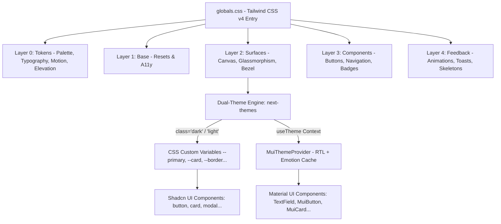

# 🎨 التحليل المعماري الشامل لنظام التصميم (Sahla 2.0 Design System)
### دراسة هندسة الألوان، المكونات، ودليل التخصيص والتطوير للمطورين

---

## 📌 1. نظرة عامة على معمارية نظام التصميم (Architecture Overview)

يعتمد نظام التصميم في منصة **سهلة (Sahla 2.0)** على معمارية هجينة حديثة (Hybrid Architecture) تمزج بين:
1. **محرك Tailwind CSS v4 المعماري المتقدم:** مع تنظيم خماسي الطبقات (5-Layer Modular Micro-Styles Architecture).
2. **مكونات Shadcn UI الموجهة بالرموز الدلالية (Semantic Tokens + CVA):** لضمان المرونة القصوى والأداء العالي.
3. **تكامل متقدم مع Material-UI v6:** مدعوم بمحرك الـ RTL التلقائي (`stylis-plugin-rtl`) ومزامنة فورية مع الوضعين الليلي والنهاري.
4. **فلسفة RTL-First والهوية الجزائرية المعاصرة:** تصميم مخصص لتجربة المستخدم الجزائرية بالخطوط العربية الحديثة (Cairo) مع دعم الأرقام الإنجليزية/اللاتينية الموحدة والعملة الوطنية (دج).



---

## 🌈 2. تحليل منظومة الألوان (Color System Deep-Dive)

### 2.1 لوحات الألوان الأساسية والهوية الجزائرية (Core Brand Palettes)
تم بناء اللوحة اللونية في `src/styles/tokens/palette.css` و `src/lib/theme/colors.ts` استلهاماً من الهوية الوطنية الجزائرية:

| اسم اللوحة | التدرجات (Scale) | درجات الألوان النموذجية | الاستخدام الدلالي في المنظومة |
| :--- | :--- | :--- | :--- |
| **الأخضر الزمردي الجزائري**<br>*(Emerald Palette)* | `50` إلى `900` | • **500:** `#10b981` (الرئيسي بالوضع الليلي)<br>• **600:** `#059669` (الرئيسي بالوضع النهاري)<br>• **700:** `#047857` (Hover نقي)<br>• **100:** `#d1fae5` (شارات وخلفيات خفيفة) | هوية المنصة الرسمية، الأزرار الرئيسية (CTA)، مؤشرات النجاح، وتأكيد المعاملات وسحب الوثائق. |
| **الذهبي الصحراوي**<br>*(Sahara Gold / Amber)* | `400` إلى `600` | • **400:** `#fbbf24`<br>• **500:** `#f59e0b`<br>• **600:** `#d97706` | شارات رتبة مدير النظام (Super Admin)، رصيد نقاط التعبئة، والاشتراكات السنوية المدفوعة. |
| **أحمر الياقوت الجزائري**<br>*(Algerian Ruby / Red)* | `400` إلى `600` | • **400:** `#f87171`<br>• **500:** `#ef4444`<br>• **600:** `#dc2626` | التنبيهات والبث الوطني العاجل، تجميد المحلات، والإجراءات الحساسة (Destructive Actions). |
| **أزرق الليل والرماديات الفاخرة**<br>*(Midnight Navy / Slate)* | `50` إلى `950` | • **950:** `#020617` (عمق OLED)<br>• **900:** `#0f172a` (سطح الكروت بالليلي)<br>• **800:** `#1e293b` (الحدود بالليلي)<br>• **50:** `#f8fafc` (الخلفية بالنهاري) | خلفيات الصفحات، الأسطح المرتفعة، القوائم الجانبية، والحدود الفاصلة. |

---

### 2.2 المتغيرات الدلالية وثنائية المظهر (Semantic Tokens & Dual-Theme)
تدار جميع المتغيرات في `src/styles/surfaces/canvas.css` ومربوطة بـ `next-themes` عبر كلاس `.dark` على وسم `<html>`:

```css
/* مثال على الفرق بين الوضعين المظلم والمشرق */
/* ── الوضع المشرق (Light Mode) ── */
html:not(.dark) {
  --background: #f8fafc;        /* رمادي فائق النقاء */
  --foreground: #0f172a;        /* كحلي داكن مقروء بنسبة تباين 14:1 */
  --card: #ffffff;              /* أبيض ناصع للكروت */
  --card-foreground: #0f172a;
  --primary: #059669;           /* زمردي داكن مريح في الإضاءة النهارية */
  --primary-foreground: #ffffff;
  --muted: #f1f5f9;
  --muted-foreground: #64748b;
  --border: #e2e8f0;            /* حدود ناعمة */
}

/* ── الوضع المظلم (Dark Mode) ── */
html.dark {
  --background: #080c14;        /* أسود كحلي عميق مضاد لإجهاد العين */
  --foreground: #f8fafc;        /* أبيض ناصع بنسبة تباين 15.5:1 */
  --card: #0f172a;              /* بطاقات زجاجية داكنة */
  --card-foreground: #f8fafc;
  --primary: #10b981;           /* زمردي ناصع ساطع في الظلام */
  --primary-foreground: #022c22;
  --muted: #1e293b;
  --muted-foreground: #94a3b8;
  --border: #1e293b;            /* حدود دقيقة غير مزعجة */
}
```

> **التأثير الانتقالي السلس (Smooth Transition):**
> تم تعيين انتقال زمني `0.25s ease` على `html, body` لضمان عدم حدوث وميض مزعج للعين عند نقر زر المظهر.

---

### 2.3 جسر التوافق مع Material UI (MUI Theme Bridge)
يتم ربط المتغيرات مع مكتبة `@mui/material` في `src/components/ui/MuiThemeProvider.tsx`:
- يحقن محول اتجاه الكتابة من اليمين لليسار (`cacheRtl`).
- يحدد `palette.mode = isDark ? "dark" : "light"` فورياً عند تبديل المظهر.
- يوحّد حواف العناصر (`borderRadius: 12px`) لتطابق فلسفة Shadcn UI.
- يعطل التحويل التلقائي للأحرف اللاتينية إلى كبيرة (`textTransform: "none"`).

---

## 🧩 3. تحليل هيكل المكونات والأسطح (Components & Surfaces)

### 3.1 طبقة الأسطح والزجاج (Surfaces & Glassmorphism)
تمنح المنصة مظهراً فخماً (Premium SaaS Feel) من خلال ملفات الأسطح في `src/styles/surfaces/`:
- **`glass.css`:**
  - كلاس `.glass-sidebar`: شريط جانبي بلوري مائل مع تأثير `backdrop-filter: blur(20px)`.
  - كلاس `.glass-card-subtle`: كروت شفافة عصرية مع تأثير رفع طفيف وتوهج زمردي خفيف عند التمرير (`Hover Elevation`).
- **`bezel.css`:**
  - كلاسات `.bezel-surface` و `.bezel-inner`: حدود ثنائية دقيقة تعطي إيحاء المعدن المصقول لأجهزة الكاونتر والبطاقات الرسمية.

---

### 3.2 المكونات الذرية القابلة لإعادة الاستخدام (Reusable UI Components)

1. **زر التحكم بالثيم (`ThemeToggle.tsx`):**
   - يدعم 3 أنماط:
     - `variant="icon"`: زر مربع بحجم `w-9 h-9` مع دوران وتكبير خفيف للأيقونة.
     - `variant="button"`: زر كامل يعرض حالة الثيم مع شارة تفاعلية ("نهاري ☀️" / "ليلي 🌙").
     - `variant="chip"`: كبسولة مدمجة.
   - محمي من وميض الـ SSR وتضارب الـ Hydration عبر فحص `mounted`.

2. **الأزرار التفاعلية (`button.tsx`):**
   - مبني بالاعتماد على مكتبة `class-variance-authority (cva)`.
   - الأنواع المدعومة (`variants`):
     - `primary`: تدرج لوني زمردي إلى التركوازي (`from-emerald-600 to-teal-600`).
     - `secondary`: مظهر هادئ مع حدود دقيقة.
     - `gold`: تدرج ذهبي كهرماني فاخر لرتب المشرفين والمدفوعات.
     - `destructive` / `danger`: أحمر ياقوتي للإجراءات الحرجة.
     - `outline`: حدود زمردية شفافة مع تعبئة عند التحويم.
     - `ghost`: شفاف تماماً حتى يتم التحويم.
   - الأحجام المدعومة (`size`): `sm` (36px), `md` (44px), `lg` (48px), `icon` (40x40px).

3. **البطاقات والحاويات (`card.tsx`):**
   - مكوّن Shadcn متكامل يضم: `Card`, `CardHeader`, `CardTitle`, `CardDescription`, `CardContent`, `CardFooter`.
   - يتكيف تلقائياً مع `--card` و `--border` في المظهرين.

4. **حقول الإدخال والنماذج (`material-text-field.tsx` و `input.tsx`):**
   - حقول Material UI مع تسميات طافية (Floating Labels) متوافقة 100% مع الكتابة من اليمين لليسار (RTL).
   - حقول Shadcn مبسطة مع حواف `rounded-2xl` وخلفية تكيفية.

---

### 3.3 المكونات المركبة والشاشات الرئيسية (Organisms & Views)

```
src/components/
├── landing/                # واجهة الهبوط والتعريف بالمنصة
│   ├── LandingNavbar.tsx   # شريط التنقل العلوي مع ThemeToggle
│   ├── hero/               # القسم الرئيسي والنداء للعمل
│   └── pricing/            # جدول وبطاقات الأسعار
├── admin/                  # لوحة تحكم مدير النظام الوطني (Super Admin)
│   ├── AdminHeader.tsx     # هيدر الإدارة مع زر "بث وطني" و ThemeToggle
│   ├── AdminTabNav.tsx     # شريط التبويبات الخماسية الحديث
│   ├── wilayas/            # مصفوفة الـ 58 ولاية التفاعلية
│   ├── live/               # شريط النشاط الحي وصحة السحابة
│   ├── tabs/               # تبويبات التحليلات، المحلات، الفوترة، الكروت، الفريق
│   └── modals/             # نوافذ التفاصيل، الفواتير، والبث العاجل
├── dashboard/              # لوحة كاونتر صاحب المحل
│   ├── DesktopSidebar.tsx  # القائمة الجانبية التكيفية مع الطي والتوسيع
│   ├── BottomNavBar.tsx    # شريط التنقل السفلي للأجهزة المحمولة
│   └── layout/             # هيدر الكاونتر والإشعارات اللحظية
└── auth/                   # شاشات الدخول والتسجيل
    ├── LoginClientView.tsx # دخول بالبريد أو QR Code
    └── RegisterClientView.tsx # فتح حساب محل جديد
```

---

## 🛠️ 4. دليل التعديل والتخصيص خطوة بخطوة (Customization Guide)

### السيناريو 1: كيف تغيّر لون الهوية البصرية الأساسي (Brand Color)
إذا أردت تغيير اللون الأساسي للموقع من الأخضر الزمردي إلى لون آخر (مثلاً الأزرق الملكي `#2563eb` أو البنفسجي `#7c3aed`):

1. **تحديث متغيرات Tailwind v4 في `src/styles/tokens/palette.css`:**
   ```css
   @theme {
     /* استبدال قيم --color-primary-50 إلى 900 بدرجات اللون الجديد */
     --color-primary-500: #2563eb;
     --color-primary-600: #1d4ed8;
     --color-primary-700: #1e40af;
   }
   ```

2. **تحديث المتغيرات الدلالية في `src/styles/surfaces/canvas.css`:**
   ```css
   html:not(.dark) {
     --primary: #1d4ed8;        /* للوضع النهاري */
     --color-border-focus: #1d4ed8;
     --ring: #1d4ed8;
   }

   html.dark {
     --primary: #3b82f6;        /* للوضع الليلي */
     --color-border-focus: #3b82f6;
     --ring: #3b82f6;
   }
   ```

3. **تحديث مصفوفة الألوان في TypeScript في `src/lib/theme/colors.ts`:**
   ```typescript
   export const colors = {
     semantic: {
       dark: {
         primary: "#3b82f6",
         primaryHover: "#2563eb",
       },
       light: {
         primary: "#1d4ed8",
         primaryHover: "#1e40af",
       },
     },
   };
   ```

4. **تحديث تدرج زر الـ Primary في `src/components/ui/button.tsx`:**
   ```typescript
   primary: "bg-gradient-to-r from-blue-600 to-indigo-600 hover:from-blue-500 hover:to-indigo-500 text-white ...",
   ```

---

### السيناريو 2: كيف تضيف متغيراً دلالياً جديداً (New Semantic Token)
لإضافة متغير جديد مثل `--color-warning` (لون التحذير الأصفر):

1. **في `src/app/globals.css`:**
   ```css
   @theme inline {
     --color-warning: var(--warning);
     --color-warning-foreground: var(--warning-foreground);
   }
   ```

2. **في `src/styles/surfaces/canvas.css`:**
   ```css
   html:not(.dark) {
     --warning: #f59e0b;
     --warning-foreground: #ffffff;
   }

   html.dark {
     --warning: #fbbf24;
     --warning-foreground: #020617;
   }
   ```

3. **الاستخدام المباشر في أي مكون:**
   ```tsx
   <div className="bg-warning text-warning-foreground border border-warning/30 p-3 rounded-xl">
     تنبيه هام للزبائن!
   </div>
   ```

---

### السيناريو 3: كيف تنشئ مكوناً جديداً متوافقاً 100% مع نظام التصميم
عند بناء مكون جديد (مثلاً `StatCard.tsx`):

```tsx
"use client";

import React from "react";
import { cn } from "@/lib/utils";
import { LucideIcon } from "lucide-react";

interface StatCardProps {
  title: string;
  value: string | number;
  subtitle?: string;
  icon: LucideIcon;
  badge?: string;
  className?: string;
}

export function StatCard({
  title,
  value,
  subtitle,
  icon: Icon,
  badge,
  className,
}: StatCardProps) {
  return (
    <div
      className={cn(
        "p-5 rounded-2xl bg-card border border-border shadow-sm hover:border-primary/40 transition-all duration-200",
        className
      )}
    >
      <div className="flex items-center justify-between mb-2">
        <span className="text-xs font-bold text-muted-foreground font-cairo">
          {title}
        </span>
        <div className="w-8 h-8 rounded-lg bg-primary/10 text-primary flex items-center justify-center">
          <Icon size={16} />
        </div>
      </div>

      <div className="text-2xl sm:text-3xl font-black text-foreground font-mono">
        {value}
      </div>

      {(subtitle || badge) && (
        <div className="flex items-center justify-between mt-2 pt-2 border-t border-border/50 text-[11px]">
          {subtitle && <span className="text-muted-foreground font-medium">{subtitle}</span>}
          {badge && (
            <span className="px-2 py-0.5 rounded-full bg-emerald-500/10 text-emerald-600 dark:text-emerald-400 font-bold font-mono">
              {badge}
            </span>
          )}
        </div>
      )}
    </div>
  );
}
```

---

### السيناريو 4: كيف تعدل الخطوط والطباعة (Typography)
تدار أسماء الخطوط في `src/styles/tokens/typography.css`:

```css
@theme {
  --font-family-ar: "Cairo", "Tajawal", -apple-system, sans-serif;
  --font-family-en: "Outfit", -apple-system, sans-serif;
  --font-family-mono: "Fira Code", monospace;
}
```
- لتغيير الخط العربي من `Cairo` إلى خط آخر (مثل `Alexandria` أو `IBM Plex Sans Arabic`):
  1. استورد الخط في `src/app/layout.tsx` عبر `next/font/google`.
  2. عيّن اسم الخط في `typography.css`.

---

## 🎯 5. القواعد والمعايير الصارمة للتطوير (Golden Rules)

1. **تجنب الألوان المباشرة (No Hardcoded Colors):**
   - ❌ تجنب: `bg-[#0f172a]` أو `text-black` أو `bg-white`.
   - ✅ استخدم: `bg-card`, `bg-background`, `text-foreground`, `text-muted-foreground`, `border-border`.

2. **التوافق التام مع اتجاه اليمين لليسار (RTL-First):**
   - استخدم `gap-*` أو هوامش متوافقة بدلاً من الاعتماد غير المحسوب على `ml-*` و `mr-*`.
   - جميع حقول الإدخال والتواريخ تراعي اللغة العربية مع دعم `dir="ltr"` للأرقام البريدية وحقول البريد الإلكتروني.

3. **الوقاية من وميض التحميل (Hydration Flash Prevention):**
   - عند إنشاء مكون يعتمد على حالة الثيم، استخدم الخطاف الموحد `useTheme()` من `@/components/ui/ThemeProvider` وافحص `mounted` لمنع أخطاء الـ SSR.

4. **السرعة والوزن الخفيف (Micro-Styles Performance):**
   - الاعتماد على CSS Variables الأصلية بدلاً من كود JavaScript الثقيل لتغيير الألوان يحقق زمن استجابة صفري وتجربة فائقة السلاسة على جميع الأجهزة.
