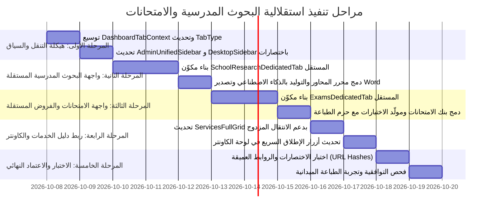

# 🎓 خطة استقلالية الميزات التعليمية: البحوث المدرسية والامتحانات (Independent Educational Modules Plan)
### تحويل "البحوث المدرسية" و"الامتحانات والفروض" إلى منظومات مستقلة سيادية · اختصارات القائمة الجانبية · والربط الذكي عبر دليل الخدمات
**منصة سهلة الرقمية — Sahla SaaS · الإصدار 2.0**

---

## 🎯 1. الرؤية والهدف الاستراتيجي (Strategic Vision)

تُعدّ **خدمات البحوث المدرسية والامتحانات** الركيزة التشغيلية الأكبر لحركة زبائن الكيوسكات والمكتبات في الجزائر (أكثر من 80% من الطلب اليومي خلال المواسم الدراسية). 

سابقاً، كانت هذه الميزات مدمجة داخل نافذة منبثقة موحدة (Studio Modal) تابعة لدليل الخدمات، مما يحدّ من مساحة العمل المتاحة لتعديل البحوث، تصفح بنك الامتحانات، وتوليد مواضيع الفروض.

### الهدف المنشود:
1. **استقلالية تامة للميزات (First-Class Standalone Modules):**
   - تحويل **"بحوث مدرسية" (School Research Studio)** إلى واجهة/تبويب مستقل كامل العرض (Full-Tab Workspace) يوفر مساحة شاسعة لبناء خطة البحث، مراجعة المحاور، والتوليد بالذكاء الاصطناعي مع التصدير الفوري لـ Word/PDF.
   - تحويل **"امتحانات وفروض" (Exams & Tests Hub)** إلى واجهة/تبويب مستقل يضم بنك الامتحانات الرسمي للـ 58 ولاية، مولّد الاختبارات التفاعلي v2.0 مع سلالم التنقيط، ونظام طباعة الحزم المجمعة (Bundle Print).
2. **اختصارات سريعة ومباشرة (Direct Sidebar & Shortcuts):**
   - إضافة روابط مباشرة واختصارات واضحة في القائمة الجانبية الموحدة لمدير النظام وكاونتر الكشك (`AdminUnifiedSidebar` و `DesktopSidebar`).
   - تعيين اختصارات لوحة مفاتيح سريعة (مثل `⌘R` للبحوث و `⌘E` للامتحانات).
3. **الدخول والربط الذكي عبر دليل الخدمات (Seamless Services Directory Entry):**
   - الاحتفاظ ببطاقتي الخدمتين في **دليل الخدمات (Services Catalog)** كنقاط انطلاق مركزية، مع إتاحة خيارين عند النقر:
     - إما التشغيل السريع المباشر (Quick Action / Studio Modal).
     - أو الانتقال الكامل لشاشة الميزة الموسعة المستقلة (Dedicated Workspace).

---

## 🧩 2. تحليل الوضع الحالي مقابل الوضع المستهدف (Current vs Target State)

```mermaid
graph TD
    subgraph الوضع الحالي (مدمج ومحصور داخل مودال)
        OldServices["دليل الخدمات (Services Catalog)"] --> OldModal["نافذة منبثقة (Studio Modal)"]
        OldModal --> SubTabs{"أزرار تبديل داخلية ضيقة"}
        SubTabs --> OldResearch["توليد البحوث"]
        SubTabs --> OldExams["بنك الامتحانات"]
        SidebarOld["القائمة الجانبية"] -.->|غياب أي رابط مباشر| OldServices
    end

    subgraph الوضع المستهدف (ميزات مستقلة + وصول ثلاثي الأبعاد)
        Nav1["القائمة الجانبية الموحدة (Sidebar)"] -->|اختصار مباشر ⌘R| DedicatedResearch["🎓 واجهة مستقلة: استوديو البحوث المدرسية"]
        Nav1 -->|اختصار مباشر ⌘E| DedicatedExams["📝 واجهة مستقلة: بنك ومولّد الامتحانات"]

        CatalogTarget["دليل الخدمات واستوديو A4"] -->|دخول مخصص| DedicatedResearch
        CatalogTarget -->|دخول مخصص| DedicatedExams

        KioskOverview["كاونتر الكشك الرئيسي"] -->|بطاقات إطلاق فوري| DedicatedResearch
        KioskOverview -->|بطاقات إطلاق فوري| DedicatedExams
    end
```

| البعد / المعيار | الوضع الحالي | الوضع المستهدف (خطة الاستقلالية) |
| :--- | :--- | :--- |
| **مساحة العمل (Workspace)** | نافذة Modal منبثقة بمساحة محصورة | شاشة كاملة (Full Viewport Tab) مع تجربة بصرية فائقة ومرونة تحرير |
| **التنقل المباشر (Direct Nav)** | غير متاح؛ يتطلب فتح دليل الخدمات ثم اختيار الخدمة | روابط مباشرة في القائمة الجانبية (`⌘R` للبحوث، `⌘E` للامتحانات) |
| **دليل الخدمات (Directory)** | نقطة الوصول الوحيدة | بوابة مركزية تتيح الفتح السريع أو الانتقال للواجهة الموسعة |
| **إدارة الفروض والامتحانات** | مكتبة ضمنية داخل المودال | منصة فرز متقدمة حسب الطور/السنة/المادة مع سلة طباعة الحزم المجمعة |
| **محرر خطة البحث** | مساحة ضيقة للأقسام والمحاور | محرر مرن يدعم السحب والإفلات، المعاينة الحية A4، وتصدير Word متكامل |

---

## 🏛️ 3. الهيكلية المعمارية لنظام التبويبات والتنقل (Tab Architecture)

### 3.1 توسيع سياق التبويبات الموحد (`DashboardTabContext.tsx` و `AdminTabNav`)
تحديث نوع التبويبات ليشمل المعرفات الجديدة:

```typescript
// src/contexts/DashboardTabContext.tsx
export type TabType =
  | "overview"          // كاونتر الكشك والعمليات
  | "services"          // دليل الخدمات واستوديو A4
  | "school-research"   // 🎓 ميزة مستقلة: بحوث مدرسية ومذكرات
  | "exams"             // 📝 ميزة مستقلة: بنك الامتحانات والفروض
  | "documents"         // سجل الوثائق والمستندات المنجزة
  | "wallet"            // المحفظة والشحن
  | "account"           // الموظفون وتسيير المحل
  | "settings"          // العتاد وإعدادات الطباعة
  | "superadmin";       // إدارة المنظومة الوطنية
```

### 3.2 دعم الروابط العميقة (Deep Linking / URL Hashes)
- `/dashboard#school-research` و `/admin#school-research`: فتح استوديو البحوث المدرسية مباشرة.
- `/dashboard#exams` و `/admin#exams`: فتح بنك ومولّد الامتحانات مباشرة.
- `/dashboard#services` و `/admin#services`: دليل الخدمات.

---

## 📑 4. تصميم الواجهات المستقلة المخصصة (Dedicated Views Design)

### 4.1 واجهة "بحوث مدرسية ومذكرات" المستقلة (`SchoolResearchDedicatedTab.tsx`)
واجهة متكاملة مخصصة بالكامل لصناعة البحوث المدرسية والجامعية:

```
┌────────────────────────────────────────────────────────────────────────┐
│ 🎓 استوديو البحوث المدرسية والمذكرات · المنهاج الجزائري الرسمي 🇩🇿        │
│ شريط أدوات سريع: [تصدير Word] [معاينة A4] [طباعة مباشرة] [رصيد: 50 ن] │
├───────────────────────────────────┬────────────────────────────────────┤
│ 🛠️ لوحة الإعدادات والتحرير         │ 📄 المعاينة الحية للبحث (A4 300DPI) │
│ • اختيار الطور (ابتدائي/متوسط/ثانوي)│ • صفحة الغلاف الرسمية              │
│ • السنة الدراسية والمادة المقررة    │ • الفهرس وخطة البحث                │
│ • موضوع البحث أو اختيار من المقترحات│ • مقدمة مستوفية الشروط             │
│ • محرر محاور البحث (Outline Editor) │ • المباحث والفصول مدعومة بالشواهد   │
│ • متطلبات الأستاذ والمصادر المعتمدة │ • الخاتمة والتوصيات وقائمة المراجع │
│ • عدد الصفحات (1 - 10 صفحات)       │ • التحكم بالتكبير (Fit / 100%)     │
└───────────────────────────────────┴────────────────────────────────────┘
```

**الميزات الرئيسية في الواجهة المستقلة:**
1. **شريط الأدوات العلوي:** عدد الكلمات، عدد الصفحات، زمن التوليد، مؤشر مطابقة المنهاج الرسمي (94%+).
2. **محرر المحاور التفاعلي:** إضافة وتعديل عناوين الفصول بنقرة واحدة قبل التوليد.
3. **تصدير Word أصلي (`.docx`):** بتنسيق رسمي معتمد جاهز للتسليم للأساتذة.
4. **سجل البحوث السابقة للتلميذ:** الوصول السريع لآخر البحوث المنجزة لإعادة طباعتها أو تعديلها.

---

### 4.2 واجهة "امتحانات وفروض رسمية" المستقلة (`ExamsDedicatedTab.tsx`)
منصة امتحانات وطنية متطورة تغطي الأطوار الثلاثة (ابتدائي، متوسط، ثانوي):

```
┌────────────────────────────────────────────────────────────────────────┐
│ 📝 بنك ومولّد الامتحانات والفروض النموذجية · الجزائر 2026 🇩🇿            │
│ التبويبات الداخلية: [ 📚 بنك الامتحانات الرسمية ] [ ⚡ مولّد الاختبارات v2.0 ]│
├────────────────────────────────────────────────────────────────────────┤
│ 🔍 فلاتر البحث المتقدم:                                                │
│ [الطور: التعليم المتوسط] [السنة: 4 متوسط BEM] [المادة: الرياضيات] [الفصل: 2] │
├───────────────────────────────────┬────────────────────────────────────┤
│ 📋 قائمة المواضيع المعتمدة        │ 🖨️ المعاينة وسلة الطباعة الجماعية   │
│ • امتحان شهادة BEM 2025 مع الحل   │ • معاينة الموضوع مع سلم التنقيط   │
│ • فرض الفصل الثاني النموذجي       │ • زر: طباعة فردية (100 دج)        │
│ • اختبار تجريبي - ولاية سطيف      │ • زر: إضافة لسلة الحزمة المجمعة   │
│ • موضوع مقترح - ولاية وهران       │ • زر: طباعة حزمة المراجعة (Bundle)│
└───────────────────────────────────┴────────────────────────────────────┘
```

**الميزات الرئيسية في الواجهة المستقلة:**
1. **الفهرسة الدقيقة:** فرز حسب الولاية، السنة، الفصل، مع وسم المواضيع المصحوبة بحلول نموذجية.
2. **سلة حزم الامتحانات (Exam Bundling):** تجميع 5 إلى 20 موضوعاً في ملف طباعة واحد للزبون مع علامة مائية مخصصة للمحل التجاري.
3. **مولّد الاختبارات الفوري:** توليد فرض أو اختبار فوري بأسئلة متدرجة الصعوبة وسلم تنقيط وزاري (على 20 نقطة).

---

## 🧭 5. تكامل دليل الخدمات والقائمة الجانبية (Integration & Navigation)

### 5.1 القائمة الجانبية الموحدة (`AdminUnifiedSidebar.tsx` و `DesktopSidebar.tsx`)
إدراج الميزات التعليمية المستقلة في قسم خاص وبارز:

```typescript
// قسم الخدمات والتعليم في القائمة الجانبية
{
  title: "الخدمات والتعليم",
  items: [
    {
      id: "school-research",
      label: "بحوث مدرسية",
      icon: GraduationCap,
      badge: "AI 2.0",
      shortcut: "⌘R",
    },
    {
      id: "exams",
      label: "امتحانات وفروض",
      icon: BookOpenCheck,
      badge: "ONEC",
      shortcut: "⌘E",
    },
    {
      id: "services",
      label: "دليل الخدمات واستوديو A4",
      icon: LayoutGrid,
      shortcut: "⌘7",
    },
  ],
}
```

### 5.2 ترقية بطاقات دليل الخدمات (`ServicesFullGrid.tsx`)
لكل بطاقة في دليل الخدمات، نوفر نمطي تفاعل:
1. **النقر الأساسي (Primary Click):** الانتقال الفوري للواجهة المستقلة الكاملة (`setActiveTab("school-research")` أو `setActiveTab("exams")`).
2. **زر الإنجاز السريع (Quick Modal Launch):** إمكانية فتح الاستوديو السريع كـ Modal للعمليات الخاطفة على الكاونتر لمن لا يرغب في مغادرة دليل الخدمات.

```tsx
{/* بطاقة الخدمة في دليل الخدمات */}
<div className="flex items-center gap-2">
  <Button 
    variant="primary" 
    onClick={() => setActiveTab("school-research")}
    className="text-xs font-bold"
  >
    <span>فتح الاستوديو الكامل</span>
    <span>↗</span>
  </Button>
  <Button 
    variant="ghost" 
    onClick={() => onOpenQuickModal(svc)}
    className="text-xs text-muted-foreground"
  >
    <span>تشغيل سريع</span>
    <span>⚡</span>
  </Button>
</div>
```

---

## 📅 6. مراحل خطة العمل والجدول التنفيذي (Implementation Roadmap)



### تفاصيل الحزم البرمجية:

| المرحلة | المهام التفصيلية | الملفات المستهدفة |
| :--- | :--- | :--- |
| **المرحلة 1: التنقل والسياق** | • إضافة `school-research` و `exams` إلى `DashboardTabContext`.<br>• إضافة الروابط والاختصارات (`⌘R`، `⌘E`) في القوائم الجانبية. | [`DashboardTabContext.tsx`](file:///home/ammar/Sahla%20/src/contexts/DashboardTabContext.tsx)<br>[`AdminUnifiedSidebar.tsx`](file:///home/ammar/Sahla%20/src/components/admin/layout/AdminUnifiedSidebar.tsx)<br>[`SidebarNavLinks.tsx`](file:///home/ammar/Sahla%20/src/components/dashboard/layout/SidebarNavLinks.tsx) |
| **المرحلة 2: استوديو البحوث المستقل** | • بناء واجهة كاملة العرض تجمع بين خيارات المنهاج ومحرر المحاور ومعاينة A4 وتصدير Word.<br>• إمكانية حفظ واسترجاع مسودات البحوث. | `src/components/dashboard/education/SchoolResearchTab.tsx`<br>[`StudioDynamicForm.tsx`](file:///home/ammar/Sahla%20/src/components/dashboard/studio/StudioDynamicForm.tsx) |
| **المرحلة 3: منصة الامتحانات المستقلة** | • بناء واجهة كاملة تضم بنك الامتحانات الرسمي ومولّد الفروض.<br>• واجهة سلة طباعة الحزم المجمعة (Bundle Print). | `src/components/dashboard/education/ExamsHubTab.tsx`<br>[`ExamsLibraryView.tsx`](file:///home/ammar/Sahla%20/src/components/dashboard/studio/ExamsLibraryView.tsx)<br>[`PracticeExamGeneratorView.tsx`](file:///home/ammar/Sahla%20/src/components/dashboard/studio/PracticeExamGeneratorView.tsx) |
| **المرحلة 4: الربط مع دليل الخدمات** | • ترقية بطاقات `ServicesFullGrid` لتوفير خيارين: الدخول المباشر للواجهة الكاملة أو الفتح السريع كـ Modal.<br>• تحديث شريط الكاونتر السريع. | [`ServicesFullGrid.tsx`](file:///home/ammar/Sahla%20/src/components/dashboard/ServicesFullGrid.tsx)<br>[`DashboardOverviewTab.tsx`](file:///home/ammar/Sahla%20/src/components/dashboard/home/DashboardOverviewTab.tsx) |
| **المرحلة 5: التدقيق والاختبار** | • التأكد من سلامة رصيد النقاط وعمليات الطباعة والتصدير.<br>• التأكد من اجتياز فحص الأنماط (`npx tsc --noEmit`). | الاختبارات الميدانية |

---

## 💡 7. تجربة المستخدم الناتجة (Expected User Experience)

1. **لزبون يبحث عن موضوع امتحان أو فرض:**
   - يضغط صاحب المحل مباشرة على زر `📝 امتحانات وفروض` في القائمة الجانبية (أو `⌘E`) أو يضغط عليها في دليل الخدمات.
   - تفتح أمامه شاشة بنك الامتحانات فوراً مع فلاتر السنة والمادة والطور، فيطبع الموضوع مع الحل وسلم التنقيط في 10 ثوانٍ!
2. **لتلميذ أو طالب يحتاج بحثاً مدرسياً متكاملاً:**
   - يضغط صاحب المحل على `🎓 بحوث مدرسية` في القائمة الجانبية (أو `⌘R`) أو في دليل الخدمات.
   - تفتح مساحة عمل مريحة يرى فيها خطة البحث والمعاينة الحية بحجمها الكامل، ويستخرج بحثاً متوافقاً مع المنهاج الجزائري أو يصدره كـ Word بنقرة واحدة!
3. **الوصول الدائم عبر دليل الخدمات:**
   - يظل "دليل الخدمات" مرجعاً رئيسياً، ولكل خدمة بطاقتها الواضحة التي تدعم كلاً من التشغيل السريع والخوض في الواجهة الموسعة.
