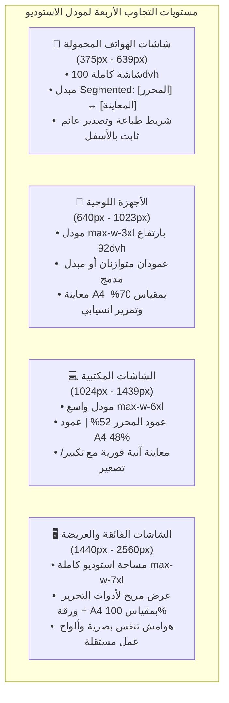
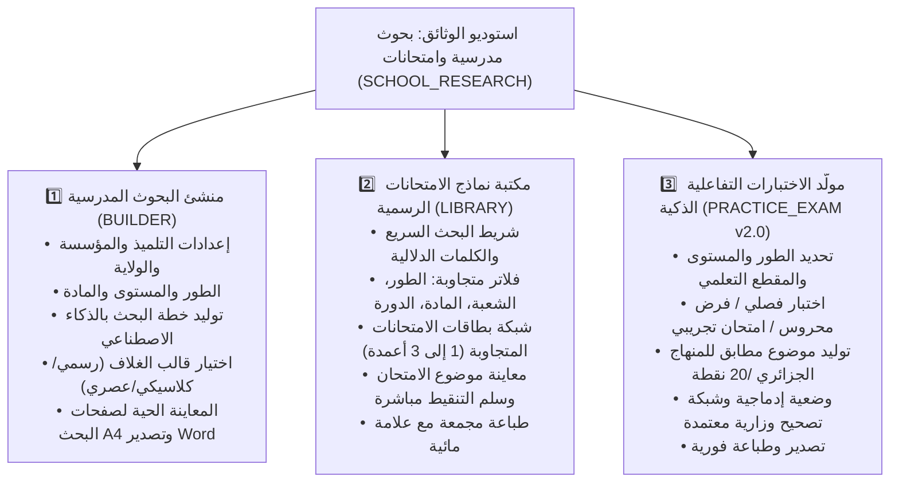

# 📐 الخطة المعمارية الشاملة: توافق وتناسق استوديو الوثائق (بحوث مدرسية وامتحانات) عبر كافة الشاشات
> **المشروع:** منصة سهلة · Sahla 2.0  
> **المكون المستهدف:** `StudioModal.tsx` و `StudioDynamicForm.tsx` و `StudioLivePreviewA4.tsx` و `ExamsLibraryView.tsx` و `PracticeExamGeneratorView.tsx` و `Modal.tsx`  
> **المرجعية التصميمية:** `skills/ui-ux-pro-max/SKILL.md` ومعايير Shadcn UI وتجربة المستخدم التعليمية الجزائرية

---

## 1. التشخيص الشامل للوضع الراهن ونقاط القصور (Audit & Pain Points)

بعد الفحص الميداني للكود المصدري للمودل والمكونات الفرعية التابعة لخدمة **البحوث المدرسية والامتحانات (`SCHOOL_RESEARCH`)**، تبيّنت نقاط القصور الآتية:

### أ. قيود حاوية المودل الأساسية (`Modal.tsx`)
1. **فقدان صنف العرض الأقصى (`maxWidth`)**: المودل يستدعي `maxWidth="max-w-5xl"`، بينما جدول الفئات في `Modal.tsx` لا يحتوي على المفتاح `max-w-5xl`، مما يجعله يعود كـ `undefined` ويفقد التحكم المنسجم في العرض الأقصى.
2. **غياب إدارة الارتفاع التفاعلي (`Viewport Height Clamping`)**:
   - المودل يستخدم `overflow-y-auto` على الغلاف الخارجي مع `my-8` و `p-4 sm:p-6`. عند كبر حجم حقول البحث أو مكتبة الامتحانات، يمتد المودل لآلاف البكسلات وتختفي الترويسة (`StudioHeader`) وأزرار الطباعة والإجراءات (`StudioPrintActions`) خارج الشاشة.
   - على الهواتف، يتسبب غياب `dvh` (Dynamic Viewport Height) في تداخل شريط متصفحات Safari/Chrome السفلي مع أزرار التحكم.
3. **مشكلة التمرير المزدوج (`Double Scrollbars`)**: يحدث تمرير في الصفحة الخارجية مع تمرير داخلي في معاينة A4 وفي قائمة الامتحانات دون عزل تدفق التمرير (`Scroll Isolation`).

### ب. قصور التخطيط المزدوج في الشاشات المختلفة (`Layout Split & Responsiveness`)
1. **على الهواتف المحمولة (Mobile: 375px - 639px)**:
   - تقسيم الأعمدة `grid grid-cols-1 md:grid-cols-2` يكدس محرر البحث الضخم (أكثر من 30 حقلاً وخياراً تعليمياً) فوق معاينة ورقة A4. يضطر المستخدم للتمرير الطويل جداً لمشاهدة شكل المستند.
   - لا يوجد مبدّل فوري (Segmented Switch) للتبديل السريع بلمسة واحدة بين **[محرر البيانات]** و **[معاينة A4 الحية]**.
   - أزرار الفلاتر في مكتبة الامتحانات تتقلص وتتداخل فيها الكلمات العربية وتختفي هوامش اللمس القياسية (44x44px).
2. **على الأجهزة اللوحية (Tablet: 640px - 1023px)**:
   - عند 768px، تنقسم الشاشة إلى عمودين ضيقين بنسبة 50%/50%، مما يجعل ورقة A4 مضغوطة للغاية ومحرر البحث ضيقاً مع نصوص مقطوعة.
   - الحاجة إلى نسبة ذكية 55% / 45% أو نمط لوحي مخصص مع تحكم تكبير A4.
3. **على الشاشات المكتبية والواسعة (Desktop & Ultra-wide: 1024px - 1920px+)**:
   - حجم `max-w-5xl` الحالي (1024px) ضيق جداً لمساحة عمل احترافية للطباعة ومعاينة A4 دقيقة (300 DPI). ينبغي توفير مساحة رحبة تصل إلى `max-w-7xl` مع تثبيت الترويسة وشريط الطباعة السفلي وتمرير مستقل لكل عمود.

### ج. تباين الأنماط بين التبويبات الثلاثة لخدمة التعليم (`SCHOOL_RESEARCH`)
- **تبويب 1: منشئ البحوث المدرسية (`BUILDER`)**: يحتاج تنظيماً هرمياً سلساً (بيانات التلميذ والمؤسسة > خيارات المنهاج والمستوى > خطة البحث والمراجع > نمط الغلاف).
- **تبويب 2: مكتبة نماذج الامتحانات (`LIBRARY`)**: عند النقر على امتحان للمعاينة، يفتح مودل فوق مودل (Nested Modals)، مما يخلق ارتباكاً في z-index وتجربة الهاتف. المطلوب عرض الامتحان مباشرة في نافذة A4 التفاعلية.
- **تبويب 3: مولد الاختبارات الذكية (`PRACTICE_EXAM`)**: حقول الطور والمستوى والشعبة تحتاج تنظيماً متجاوباً وتنسيقاً سلساً لبطاقات التمارين وسلم التنقيط.

---

## 2. الرؤية التصميمية وفق معايير UI-UX-PRO-MAX

| المعيار | التطبيق في استوديو الوثائق |
| :--- | :--- |
| **هندسة الحاوية (Modal Anatomy)** | رأس ثابت (`Header Sticky`) + جسم مرن بتمرير معزول (`Scrollable Body`) + شريط إجراءات ثابت (`Sticky Footer Bar`). |
| **تجاوب الهواتف (Mobile Sheet Mode)** | التحول لشاشة كاملة سلسة ملء الشاشة (`h-full sm:h-auto sm:max-h-[92dvh]`) مع مبدل تفاعلي عالي التباين بين المحرر والمعاينة. |
| **محرك تحجيم A4 (Adaptive A4 Viewport)** | مقياس تكبير وتصغير تفاعلي (50% / 75% / 100% / احتواء الشاشة `Fit`) مع تبديل الصفحات بأسهم لمسية واسعة (≥44px). |
| **ألوان ونمط Shadcn المتكامل** | التوافق الكامل مع الثيم الداكن والفاتح، واستبدال الألوان الصلبة بمتغيرات النظام الدلالية (`bg-card`, `text-foreground`, `border-border`, `bg-muted`). |
| **صفر إيموجي كعناصر تحكم** | استخدام أيقونات SVG خطية هندسية منسجمة بالكامل (Phosphor / Lucide Icons). |
| **إمكانية الوصول واللمس (A11y)** | مستهدفات لمسية لا تقل عن 44×44px، نصوص عالية التباين (4.5:1)، وانتقالات سلسة (150-250ms). |

---

## 3. الهندسة المتجاوبة عبر 4 أبعاد للشاشات

### 📱 1. شاشات الهواتف المحمولة (Mobile: 375px – 639px)
- **الحاوية:** `w-full h-[100dvh] rounded-none sm:rounded-3xl` بدون هوامش خارجية ضائعة، ملء الشاشة الكامل لاستغلال كل بكسل.
- **الترويسة:** ترويسة مدمجة مقتضبة تتضمن زر الإغلاق، اسم الوثيقة، ورصيد النقاط في سطر واحد بارتفاع مريح.
- **مبدّل العرض التفاعلي (Segmented View Switcher):**
  - شريط تبويب مثبت أسفل الترويسة مباشرة:
    - زر `✏️ محرر البيانات والخيارات`
    - زر `📄 معاينة ورقة A4 الحية (الصفحة X من Y)`
  - إمكانية التنقل السريع التلقائي عند الضغط على "توليد المعاينة" أو تعديل أي حقل.
- **محرر البحوث:**
  - تحويل حقول الإدخال إلى عمود واحد عمودي مريح (`grid-cols-1`).
  - أزرار اختيار الأطوار والمستويات كرقائق لمسية عريضة (`chips`) سهلة النقر.
- **شريط الإجراءات السفلي (Bottom Sticky Bar):**
  - مثبت في قاع الشاشة مع مراعاة `safe-area-inset-bottom`.
  - أزرار عريضة: زر الطباعة الفورية وزر إلغاء/إغلاق بحجم لا يقل عن 48px.

### 📲 2. الأجهزة اللوحية (Tablet: 640px – 1023px)
- **الحاوية:** `w-[95vw] max-w-4xl max-h-[92dvh] rounded-2xl` مع هوامش مريحة `p-4`.
- **التخطيط:**
  - نمط شبكي ذكي مرن: محرر البحث بعرض 54% ولوح المعاينة A4 بعرض 46%.
  - إمكانية طي/توسيع لوح المعاينة بضغطة زر لمنح المستخدم مساحة كتابة أكبر عند الحاجة.
- **لوح A4:**
  - تكبير افتراضي بنسبة 70% ليظهر كامل الصفحة دون اقتصاص أفقي.
  - أزرار تقليب الصفحات واضحة ومثبتة أعلى الورقة.

### 💻 3. الشاشات المكتبية القياسية (Desktop: 1024px – 1439px)
- **الحاوية:** `max-w-6xl w-full max-h-[90dvh] rounded-2xl shadow-2xl flex flex-col`.
- **التخطيط ثنائي الألواح المتزامنة (Dual-Pane Workspace):**
  - **اللوح الأيمن (المحرر):** `w-1/2 overflow-y-auto pr-2 pl-4` يضم التبويبات الفرعية وحقول المنهاج الجزائري.
  - **اللوح الأيسر (معاينة A4 الحية):** `w-1/2 overflow-y-auto sticky top-0 bg-slate-100/90 dark:bg-slate-950/80 p-5 rounded-2xl border` يضم ورقة A4 ثلاثية الأبعاد بظلال ناعمة (Claymorphism Paper Effect) مع تحكم كامل بنسبة التكبير (Fit / 75% / 100%).
- **التزامن اللحظي:** أي حرف يُكتب في عنوان البحث أو اسم التلميذ أو الأستاذ أو الخطة ينعكس فوراً على ورقة الغلاف أو صفحة العرض دون أي تأخير بصري.

### 🖥️ 4. الشاشات العريضة وفوق العريضة (Ultra-Wide: 1440px – 2560px)
- **الحاوية:** `max-w-7xl max-h-[88dvh]` مساحة استوديو كاملة.
- **التخطيط:** مساحة رحبة تسمح بعرض ورقة A4 بحجمها الطباعي الحقيقي الطبيعي (100% Scale 300DPI) بجانب محرر غني بالخيارات، دون الحاجة للتصغير أو التمرير الأفقي.

---

## 4. هندسة التبويبات الثلاثة لخدمة البحوث المدرسية والامتحانات

تضم خدمة `SCHOOL_RESEARCH` ثلاثة أوضاع عمل رئيسية يجب أن تتكامل بسلاسة داخل المودل المتجاوب:

### أ. تحسينات منشئ البحوث المدرسية (`BUILDER`)
1. **هيكلة الحقول في بطاقات دلالية قابلة للتصفح السريع:**
   - **بطاقة 1: هوية الوثيقة والتلميذ:** الاسم، المؤسسة، الأستاذ، مديرية التربية للولاية.
   - **بطاقة 2: المسار الدراسي والمنهاج:** الطور، السنة، المادة المقررة، المقطع التعليمي.
   - **بطاقة 3: إعدادات البحث والتصميم:** عدد الصفحات، قالب الغلاف، أسئلة المراجعة التقويمية.
   - **بطاقة 4: خطة البحث المعتمدة ومولد الفصول:** مولد الخطة المعتمدة تلقائياً.
2. **محرك المعاينة وتقليب الصفحات:**
   - شريط تقليب صفحات ذكي: الصفحة 1 (الغلاف الرسمي)، الصفحة 2 (الفهرس والمقدمة)، الصفحة 3+ (المباحث والخاتمة والمراجع).
   - زر تصدير Word متاح بوضوح ومناسب للشاشات الصغيرة والكبيرة.

### ب. تحسينات مكتبة الامتحانات (`LIBRARY`)
1. **فلاتر متجاوبة بذكاء:**
   - تحويل صف الفلاتر الحالي (الذي يتداخل في الشاشات الصغيرة) إلى شبكة مرنة:
     - على الهواتف: شريط بحث رئيسي مع زر كشف الفلاتر المتقدمة (Drawer أو Collapsible Accordion).
     - على التابلت والمكتبي: شبكة فلاتر منسجمة بخط واضح وقوائم منسدلة أنيقة.
2. **إلغاء المودل المتداخل (No Nested Modals):**
   - بدلاً من فتح نافذة منبثقة ثانية (`viewingExam`)، يتم عرض ورقة الامتحان والحل مباشرة داخل مساحة المعاينة A4، مع زر عودة سلس على الهواتف.

### ج. تحسينات مولّد الاختبارات بالذكاء الاصطناعي (`PRACTICE_EXAM`)
1. **تنسيق شبكة الإعدادات:**
   - جعل حقول "الطور والمستوى" و "المادة" و "نوع الاختبار" تتكيف بين عمود واحد على الهاتف و 3 أعمدة على الشاشات الكبيرة.
2. **عرض موضوع الامتحان وسلم التنقيط:**
   - تبويب تبديل سريع وواضح: `[ موضوع الاختبار ]` و `[ عناصر الإجابة وشبكة التنقيط /20 ]`.
   - زر الطباعة المباشرة مع تخصيص احتساب النقاط التلقائي.

---

## 5. محرك معاينة ورقة A4 التفاعلي (`Interactive A4 Viewport & Zoom Engine`)

ورقة A4 الطباعية تملك نسبة أبعاد ثابتة قياسية هي **1 : 1.414** (عرض 210مم × ارتفاع 297مم). لعرضها دون تشوه أو صعوبة قراءة:

1. **حاوية العرض المطابقة للنسبة (Aspect-Ratio Container):**
   - تطبيق `aspect-[1/1.414]` مع خلفية بيضاء نقية وظلال الورقة الفيزيائية (`shadow-2xl shadow-slate-900/10 dark:shadow-black/50`).
2. **شريط أدوات المعاينة العائم (Floating Preview Controls):**
   - **مفتاح التكبير/التصغير (Zoom Controls):**
     - `Fit` (احتواء تلقائي للارتفاع والعرض).
     - `75%` (قراءة مريحة للشاشات المتوسطة).
     - `100%` (عرض مطابق تماماً للورق المطبوع).
   - **محدد الصفحة الحالية (Pagination Slider/Buttons):**
     - أزرار تنقل لمسية سريعة بحجم 44px مع مؤشر واضح `الصفحة 1 من 3`.
3. **أزرار الإجراءات السريعة في المعاينة:**
   - زر **تصدير Word (.doc)** بأيقونة زرقاء أنيقة.
   - زر **تقرير المطابقة الوزارية** مع نسبة المطابقة (مثل `مطابقة 94% للمنهاج`).
   - زر **الإبلاغ عن خطأ لغوي أو علمي**.

---

## 6. مصفوفة الملفات والتعديلات المقترحة

| الملف المستهدف | نوع التعديل | وصف التحسين |
| :--- | :--- | :--- |
| `src/components/ui/Modal.tsx` | هيكلي / عام | • إضافة فئات الحجم الكاملة (`max-w-5xl`, `max-w-6xl`, `max-w-7xl`, `full`). • دعم نمط ملء الشاشة على الهاتف `h-[100dvh]` مع رأس وتذييل ثابتين وتمرير داخلي معزول. • منع قص أو اختفاء أزرار التحكم خلف شريط المتصفح (`dvh`). |
| `src/components/dashboard/studio/StudioModal.tsx` | رئيسي | • تحويل العرض الأقصى إلى `max-w-7xl` لبيئة الاستوديو. • إضافة مبدل Segmented Toggle على الهواتف والأجهزة اللوحية (`[المحرر] ↔ [المعاينة]`). • عزل التمرير في عمودي المحرر والمعاينة. |
| `src/components/dashboard/studio/StudioHeader.tsx` | تجاوب / UI | • جعل الترويسة مرنة وصغيرة الارتفاع على الهواتف مع الحفاظ على وضوح الرصيد واسم الخدمة وأيقونتها. |
| `src/components/dashboard/studio/StudioDynamicForm.tsx` | تجاوب / UX | • تنظيم تبويبات التعليم الثلاثة (`BUILDER`, `PRACTICE_EXAM`, `LIBRARY`) بتصميم لمسي عريض. • تنسيق بطاقات خيارات المنهاج والصفوف بمستهدفات لمسية ≥44px. |
| `src/components/dashboard/studio/StudioLivePreviewA4.tsx` | محرك المعاينة | • إضافة محرك تحجيم وتكبير تفاعلي (Fit / 75% / 100%). • أزرار تقليب صفحات لمسية مريحة. • ضمان توافق الخطوط والأبعاد مع قياس A4 الحقيقي بدون كسر التخطيط. |
| `src/components/dashboard/studio/ExamsLibraryView.tsx` | فلاتر وشبكة | • تحويل شريط الفلاتر إلى شبكة مرنة متجاوبة. • بطاقات امتحانات متجاوبة (1 عمود بالهاتف، 2 بالتابلت، 3 بالمكتبي). • دمج المعاينة بسلاسة دون نوافذ متداخلة مزعجة. |
| `src/components/dashboard/studio/PracticeExamGeneratorView.tsx` | نموذج التوليد | • جعل شبكة خيارات التوليد متجاوبة (1 إلى 3 أعمدة). • تنسيق شريط تبديل [الموضوع] و [عناصر الإجابة] بأسلوب Shadcn نقي. |
| `src/components/dashboard/studio/StudioPrintActions.tsx` | شريط الإجراءات | • جعله شريطاً عائماً ثابتاً في القاع مع خلفية زجاجية ضبابية (`backdrop-blur-md`). • دعم هوامش الأمان للهواتف (`pb-safe`). |

---

## 7. مراحل التنفيذ التفصيلية (Phased Implementation Plan)

### المرحلة 1: ترقية حاوية المودل الأساسية (`Modal.tsx`) وتثبيت هندسة الاستوديو
- تحديث `Modal.tsx` ليدعم خيارات `max-w-5xl`, `max-w-6xl`, `max-w-7xl`, `full`.
- إضافة خيار هيكلي جديد `layout="workspace"` أو استخدام `flex flex-col h-[100dvh] sm:h-auto sm:max-h-[92dvh]` بحيث يكون الرأس ثابتاً، والمحتوى يتدفق بتمرير داخلي حر، والتذييل ثابتاً في الأسفل.
- معالجة هوامش الهاتف وإزالة هوامش `my-8` غير المجدية على الشاشات الصغيرة.

### المرحلة 2: تحديث `StudioModal.tsx` ونظام التبديل المتجاوب (Mobile Segmented Toggle)
- إضافة حالة تفاعلية `activeMobileView: "FORM" | "PREVIEW"` للتحكم في العرض على الشاشات أقل من 1024px.
- إضافة شريط تبديل لمسي سريع أعلى الاستوديو يظهر فقط في الشاشات الصغيرة والمتوسطة.
- تقسيم الشاشة إلى عمودين مستقلين على الشاشات الكبيرة (`lg:grid lg:grid-cols-12` حيث المحرر 7 أعمدة والمعاينة 5 أعمدة أو 6/6).

### المرحلة 3: تحسين تجربة محرر البحوث والامتحانات ومكتبة النماذج
- ضبط `StudioDynamicForm.tsx` لتنظيم الحقول في بطاقات دلالية وتوسيع مساحات النقر.
- إعادة هيكلة فلاتر `ExamsLibraryView.tsx` لتعمل بمرونة على الشاشات الصغيرة دون نصوص مقطوعة، وعرض بطاقات الامتحانات بشبكة متجاوبة سلسة.
- تحديث `PracticeExamGeneratorView.tsx` لتحسين شبكة التحكم وعرض مواضيع الاختبار وحلولها.

### المرحلة 4: ترقية محرك معاينة ورقة A4 وشريط الطباعة والتصدير
- تزويد `StudioLivePreviewA4.tsx` بنظام تكبير/تصغير بصري مع شريط تقليب صفحات مرن.
- تثبيت `StudioPrintActions.tsx` في قاع المودل بخلفية ضبابية أنيقة وأزرار متجاوبة عالية التباين في الثيمين الداكن والفاتح.
- إجراء اختبار شامل على 4 قياسات (375px هاتف، 768px تابلت، 1280px مكتبي، 1920px شاشة عريضة).

---

## 8. معايير القبول والتأكيد (Verification & Acceptance Criteria)
1. ✅ **على الهاتف (375px - 430px):** المودل يملأ الشاشة بسلاسة، لا يوجد تمرير أفقي أو خروج للأزرار، ويمكن للمستخدم الانتقال بين المحرر ومعاينة A4 بلمسة واحدة.
2. ✅ **على التابلت (768px):** تناسق تام بين حقول الإدخال والوثيقة مع إمكانية قراءة نصوص ورقة A4 بوضوح.
3. ✅ **على الشاشات المكتبية (1024px فما فوق):** بيئة استوديو واسعة ثنائية الألواح مع ترويسة ثابتة وشريط طباعة ثابت ومزامنة فورية لكل ما يُكتب.
4. ✅ **التناسق مع الثيمين:** التزام كامل بمتغيرات Shadcn والوضع المظلم والمشرق وخلو تام من الإيموجي في الأزرار التفاعلية.
